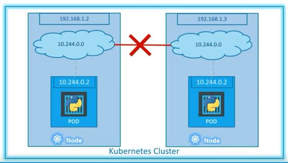
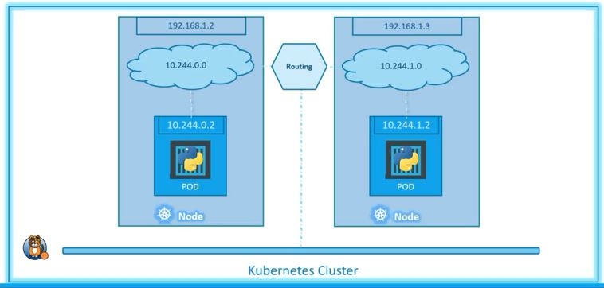
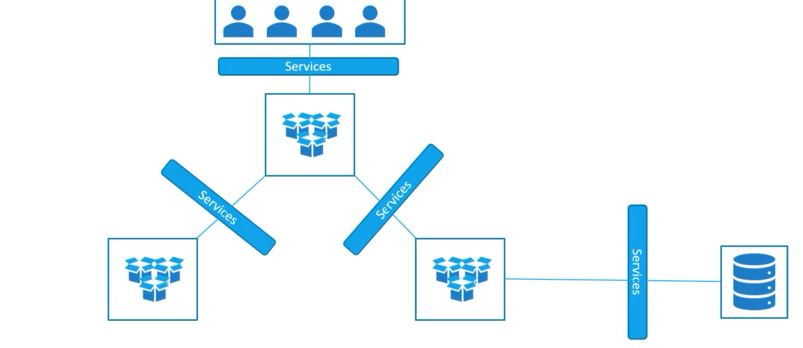
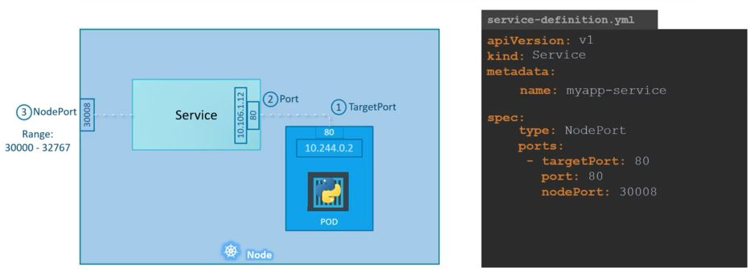
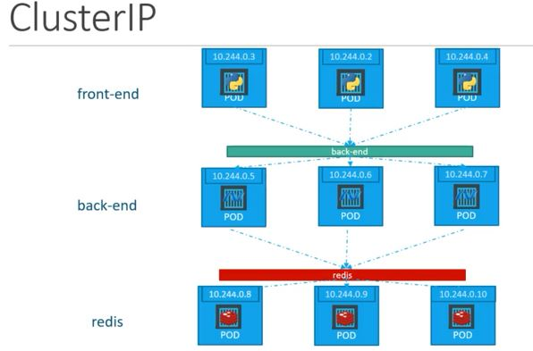
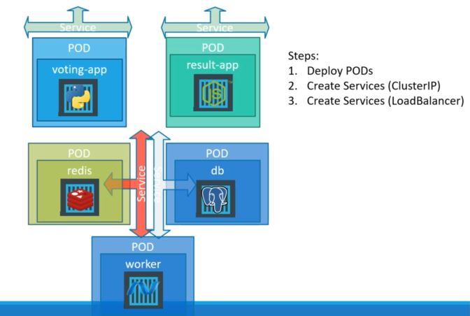

# Kubernetes exam

## Docker

### Pelado Nerd

```console
docker ps 
# muestra contenedores corriendo
docker ps -a 
# muestra incluso los contenedores muertos
docker run hello-world 
# busca el contenedor hello world en la máquina - si no está lo descarga y lo corre
# busca en el docker registry, el repositorio público de docker
docker pull alpine 
# docker pull image - por defecto latest
docker pull alpine:3.7 
# descargar una versión específcia
docker run alpine:3.7 ls -l 
# correr un comando 
docker run -it alpine:3.7 sh 
# correr una interactive terminal
docker exec -it <containerID> sh 
# abrir un contenedor que está corriendo - antes tengo que saber cuál es el container ID con docker ps - exec: ejecutar un comando en el contenedor
#########
docker run -it ubuntu /bin/bash
	root@ee940ed3a156:/# apt-get update
	root@ee940ed3a156:/# apt-get install figlet
# ahora vamos a hacer un commit con la imagen modificada
docker ps -a 
# para ver los contenedores anteriores
docker commit <contID> 
# ponemos el ID de la imagen que queremos - docker commit ee940ed3a156
docker image ls | head 
# ver las 10 primeras imágenes en la compu - nosmuestra Repository Tag y ID
docker image tag <contID> <nombreParaAcordarnosMejor>:<version|tag>
docker run asdf figlet hola 
# nos debería correr con la imagen creada anteriormente

# Docker file
# Siempre arranca con FROM para indicar que se basa en otra imagen - no tienen interacciones los docker files
vi Dockerfile
# ----------
FROM ubuntu

RUN apt-get update && apt-get install figlet -y
# ----------

docker build -t midocker:1.1 .

docker image history <contID>
# muestra comandos originales del ubuntu

# al mismo archivo le agregamos
# ----------
RUN touch /tmp/hola
# ----------
# construimos otra imagen con el nuevo docker file actualizado
docker build -t midocker:1.2 .
# mucho más rápido pues debería estar cacheado
#########
docker up -d ngingx:1.15.7
sudo docker run -d -p 80:80 --name=mynginx nginx
# -d dejar coriendo un contenedor en background - debe correr un servicio, no un comando que entra y saletipo ls
docker exec -it <contID> <command>
# VOLÚMENES: en docker podemos montar en el contenedor un archivo que está en el host
docker stop <contID>
docker run -v <path of source file or complete dir to run>:<destionation inside container>:<read only? -ro> -d <contID> 
# docker run -v /home/jaliaga/Documents/GitHub/21_linux/k8s/volume/index.html:/usr/share/nginx/html/index.html:ro -d nginx:1.15.7
# -p expone un puerto desde el contenedor hacia el host
docker run -v <path of source file or complete dir to run>:<destionation inside container>:<read only? -ro> -p <puerto del host>:<a cuál apunta en el contenedor> -d <contID> 
# docker run -v /home/jaliaga/Documents/GitHub/21_linux/k8s/volume/index.html:/usr/share/nginx/html/index.html:ro -p 8080:80 -d nginx:1.15.7
# desde el host: curl localhost:8080 y...
# [jaliaga@osboxes k8s]$ curl localhost:8080
# <html>
# 	<body>
# 		<h1>Hola desde Dockercillio</h1>
# 	</body>
# </html>
# [jaliaga@osboxes k8s]$

#########
# pasar variables con -e
docker run -e MYSQL_ROOT_PASSWORD=miclave -e MYSQL_DATABASE=midb -v /home/jaliaga/mysql-data:/var/lib/mysql -d mysql:8.0.13
# docker-compose - crear todos los contenedores que necesito en un archivo yml
# ----------
version: '3.1'

services:

  wordpress:
    image: wordpress:php7.2-apache
    ports:
      - 8080:80
    environment:
      WORDPRESS_DB_HOST: mysql
      WORDPRESS_DB_USER: root
      WORDPRESS_DB_PASSWORD: root
      WORDPRESS_DB_NAME: wordpress
    links:
      - mysql:mysql

  mysql:
    image: mysql:8.0.13
    command: --default-authentication-plugin=mysql_native_password
    environment:
      MYSQL_DATABASE: wordpress
      MYSQL_ROOT_PASSWORD: root
    volumes:
      - /home/jaliaga/docker/mysql-data:/var/lib/mysql

# ----------
# while on the folder where the docker-compose file is 
docker-compose up -d
#########
```

Networking en Docker

5 tipos de drivers en docker:

1. brdige: la interfaz de red del host le pasa toda la comunicación al contenedor
2. host: "bindea" todos los puertos en tu máquina y pasa derecho al contenedor. usa la misma IP que el host, no hay NAT, pasa derecho.
3. overlay: crear redes virtuales entre los contenedores - misma red para varios nodos. Facilita la comunicación entre los contenedores.
4. macvlan: asignar una MAC a un contenedor para que el contenedor corrar como si fuera otra máquina más 
5. none: desactiva el networking del contenedor

## udemy course

Installing Docker on ubuntu VM

```console
sudo su -
sudo apt install docker.io -y
```

docker commands

```console
docker version
docker run hello-world
docker run docker/whalesay cowsay boo
```

container orchestration: automatically scale up or down based on the load. App is highly available - user traffic is load balanced, scale up and down

Kubernetes: container orchestration technology used to orchestrate the deployment and management of hundreds and thousands of containers in a clustered environment.

- Node: a machine, physical or virtual, on which kubernetes is installed. a Node is a worker machine and that is _where containers will be launched by k8s_. nodes aka minions.
- cluster: a set of nodes grouped together - if one node fails, the app is still accessible. having multiple loads helps with sharing load.
- master: responsible for managing the cluster - another node with kubernetes installed on it. it's responsible for the actual orchestration of the containers on the worker nodes.

when you install kubernetes on a system you are installing:

- API Server: front end for kubernetes cluster
- etcd service or etcd key store: distributed reliable key value used by kubernetes to store all data used to manage the cluster. responsible for implementing locks within the cluster to ensure that there are no conflicts between the masters
- kubelet: the agent that runs on each node of the cluster. it's responsible for making sure that containers are running on the nodes as expected.
- container runtime: underlying software that is used to run containers - in this case, Docker.
- controller: the brains behind orchestration. responsible for noticing and responding when nodes go down. it makes decission to bring up new containers in such cases. 
- scheduler: distributing load accross multiple nodes. it looks for newly created containers.

| Master | Worker |
| ---- | ----- |
| kube-apiserver| kubelet agent|
| etcd | |
| controller | |
| scheduler | |
| | container runtime (Docker)|

`kubectl` : used to deploy and manage applications on a k8s cluster. to deploy an app: `kubectl run hello-minikube`. view information about a cluster: `kubectl cluster-info`. view all the nodes part of the cluster: `kubectl get nodes`

<https://kodekloud.com/courses/kubernetes-for-the-absolute-beginners-hands-on/lectures/5995932>

- `kubectl version`
- `kubectl get nodes -o wide` --> view human readable information
- `kubectl get pods` view avialable PODS
- `kubectl get pods -o wide` view pod ip add
- `minikube start`

PODS: the application is already developed on a docker image and on a docker repository. the k8s cluster is already setup.

objective of k8s: deploy application on containers on a set of machines configured as worker nodes on a cluster. k8s does not deploy containers directly on the worker nodes - containers are encapsulated into a k8s object, known as pods. a POD is a single instance of an application. a pod is the smallest object that you can create in k8s. 1 POD = 1 instance/container. to scale up you create new pods.

a single POD can have multiple containers but not of the same kind. there might be a helper container

- helper container: supporting task

helper and main container can communicate with each other using localhost port since they share the same network space. they can also share the same storage space. it's not that common to have 2 containers on a single pod

to deploy a pod: `kubectl run nginx --image nginx` --> it creates a docker container by creating a POD.

- `kubectl describe pods` : get more infor

yaml failes, pod-definition.yml, always contain 4 fields:

```yml
# 
apiVersion: v1  # <----------MANDATORY
kind: Pod   # <----------MANDATORY
# POD
# Service
# ReplicaSet
# Deployment
metadata:     # <----------MANDATORY
  name: myapp-pod
  labels:
    app: myapp
    type: front-end
# this is a dictionary
spec:   # dictionary    <----------MANDATORY
  containers:   # list/array
    - name: nginx-container
      image: nginx
```

run `kubectl create -f <file>.yml` to create a pod.

- delete a pod: **kubectl delete pod <podName>**

Controllers are the brains behind k8s. processes that monitor k8s objects and respond accordingly.

**Replication controller**. best practice is to have at least 2 pods running the same instance of an app in case one fails. replication controller helps you run multiple instances of a single pod in the cluster, thus providing HA. The replication controller does not need to be running 2 instances of the same pod - it can detect when a pod fails and spin up a new one. replication controller can also be used to balance the load. the replication controller can span multiple nodes accross the cluter. this technology is being replaced by replica set.

**Replica set**. recommended way of setting up replication. 

Creating a replication controller using yaml.

```yml
apiVersion: v1
kind: ReplicationController
metadata:
  name: myapp-rc
  labels:
    app: myapp
    type: front-end
spec:
  template:
    metadata:
      name: myapp-pod
      labels:
        app: myapp
        type: front-end
    spec:
      - name: nginx-container
        image: nginx
  replicas: 3
```

We use the template section to be used by the replication controller. To see the number of replicas that are running: `kubectl get replicationcontroller`.

Replica Set:

```yml
apiVersion: apps/v1 # <-- important
kind: ReplicaSet
metadata:
  name: myapp-replicaset
  lables:
    app: myapp
    type: front-end
spec:
  template:
    metadata:
      name: myapp-pod
      labels:
        app: myapp
        type: front-end
    spec:
      containers:
        - name: ndingx-controller
          image: nginx
  replicas: 3
  selector: 
    matchLabels:
      #type: front-end
      app: myapp
```

selector section helps the replica set identify what pods fall under it. this is necessary because replica sets can also manage pods that were not created as part of the replica set creation, for instance, pods with the same label that were created prior to the deployment of the replica set.

The selector is not a required field for replication controller but it's available.

Labels and Selectors

The role of replica sets is to monitor pods and deploy new ones in case they fail. It's a process that monitors the pods. In order for the replica set to monitor the pods, we have to create pods using labels.

To update a replica set:

1. update the number of replicas in the definition file, then run `kubectl replace -f <file>.yml`
2. `kubectl scale --replicas=<q> -f <file>.yml`
3. `kubectl scale --replicas=6 replicaset <file>` --> no modification of the file

To delete a replica set: `kubectl delete replicaset myapp-replicaset`

<https://gist.github.com/John-Lin/1dc063b6743f311561f2fe587e035c33>

Deployment

Deployment is a k8s object. Provides the capability to upgrade the underlying instances seamlessly. To create a deployment we create a definition file

```yml
apiVersion: apps/v1 
kind: Deployment # main change
metadata:
  name: myapp-deployment
  labels:
    app: myapp
    type: front-end
spec:
  template:
    metadata:
      name: myapp-pod
      labels:
        app: myapp
        type: front-end
    spec:
      containers:
        - name: ndingx-controller
          image: nginx
          # image: nginx:1.12-alpine
  replicas: 3
  selector: 
    matchLabels:
      #type: front-end
      app: myapp
```

To create the deployment: `kubectl create -f <file>.yml`

`kubectl get deployments | replicaset | pods`

So far noy many differences between deployment and replica set; deployments create a new k8s _OBJECT_.

`kubectl get all` - `kubectl describe deployment`

Rollouts and version in a deployments: when you first create a deployment, it triggers a _rollout_. a new rollout  creteas a new _deployment revision_. A new version creates a new revision.

- `kubectl rollout status deployment/myapp-deployment` --> see the status of the app rollout
- `kubectl rollout history deployment/myapp-deployment` --> revision and history of the deployment

Two deployment strategies.

1. destroy all the instances at once and crete new instances; app is down and inaccessible. <-- **recreate** stratege
2. we destroy instnaces one by one. app does not go down and the upgrade is seamless <-- **rolling** upgrade. This is the default rollout strategy.

To update a deployment: we make modifications to the deployment file and then use `kubectl apply -f <file>.yml`. a new rollout  is triggered and a new revision is created. `kubectl set image deployment/myapp-deployment nginx-container=nginx:1.7.1` to update the image of the application

Upgrades:

1. creates a replica set that creates the number of pods to meet the number of repicas.
2. on the new replica set, it creates the pod with the new version and then takes down one pod of the original replica set.

`kubectl get replicasets`

Rollback: `kubectl rollout undo deployment/myapp-deployment` - it destroys new pods and brings back previous.

`kubectl run nginx --image=nginx` --> it creates a deployment, not just a pod.

We can add the flag `--record` to save the command used to create the rollout.

### Networking in k8s

IP addresses are assigned to a POD, each pod has a internal IP address. When k8s is initially ocnfigured, we create an internal private netwowk with an address and all pods are attached to it. Each POD has a separate IP address.

- node 192.168.1.2
  - pod 10.244.0.2

IPs are reassigned when pods are destroyed (duh!).

Communication between nodes



- All containers/PODs can communicate to one another without NAT
- All nodes can communicate with all containers and vice-versa without NAT



```console
kubectl get pods
kubectl get pods -o wide
```

### Services

Servicies enable communication between components. Enable loose coupling between microservices of an application.



External communication

Something that allow us to map requests to the node running a pod from the outside. A k8s service comes into play: the service is an object that listens on a port and forwards requests on that port to a port on a pod running an app. **NodePort service**.

Another type of service is **ClusterIP** - the service creates a virtual IP inside the cluster to enable communication between different services such as FE - BE servers.

The third type is a **LoadNalancer** - distribute the load of FE servers, for instance.

1. NodePort: there are three ports involved:
   1. the port of the node - NodePort 30008 range 30000 - 32767
   2. the port of the service - _the port_. from the POV of the service
   3. the port of the pod - where the webserver is running - it's refered to as **target port**.
  
We use definition files to create a service:

```yml
# service-definition.yml
apiVersion: v1
kind: Service
metadata:
  name: myapp-service
spec:
  type: NodePort
  ports:
    - targetPort: 80
      port: 80 # <-- mandatory
      nodePort: 30008
  selector:       # connection to the POD using LABELS - links the server to the POD
    app: myapp
    type: front-end
```



```console
kubectl create -f service-definition.yml
kubectl get services

curl http://<nodeIp>:30008
```

when there are multiple nodes, NodePort uses a random algorithm to assign load.

when the app is on pods on different nodes, k8s creates a service that spans accross all the nodes on the cluster and maps the target port to the same node port on all the nodes in the cluster. this way we can access the app using any of the ips of the nodes on the cluster.



```yml
# service-definition.yml
apiVersion: v1
kind: Service
metadata:
  name: back-end
spec:
  type: ClusterIP
  ports:
    - targetPort: 80
      port: 80
  selector:
    app: myapp
    type: back-end
```

### Miniservices voting app

```console
# docker run -d --name=redis redis
# docker run -d --name=db postgres:9.4
# docker run -d --name=vote -p 5000:80 --link redis:redis voting-app
# docker run -d --name=result -p 5001:80 --link db:db result-app
# docker run -d --name=worker --link db:db --link redis:redis worker
```

Using the `--link` creates an entry to the /etc/hosts file on the app container

Definition files for PODs

```yml
# voting-app-pod.yml
apiVersion: v1
kind: Pod
metadata:
  name: voting-app-pod
  labels:
    name: voting-app-pod
    app: demo-voting-app
spec:
  containers:
    - name: voting-app
      image: dockersamples/examplevotingapp_vote
      ports:
        - containerPort: 80

# worker-app-pod.yml
apiVersion: v1
kind: Pod
metadata:
  name: worker-app-pod
  labels:
    name: worker-app-pod
    app: demo-voting-app
spec:
  containers:
    - name: worker-app
      image: dockersamples/examplevotingapp_worker

# result-app-pod.yml
apiVersion: v1
kind: Pod
metadata:
  name: result-app-pod
  labels:
    name: result-app-pod
    app: demo-voting-app
spec:
  containers:
    - name: result-app
      image: dockersamples/examplevotingapp_result
      ports:
        - containerPort: 80

# redis-pod.yml
apiVersion: v1
kind: Pod
metadata:
  name: redis-pod
  labels:
    name: redis-pod
    app: demo-voting-app
spec:
  containers:
    - name: redis
      image: redis
      ports:
        - containerPort: 6379

# postgres-pod.yml
apiVersion: v1
kind: Pod
metadata:
  name: postgres-pod
  labels:
    name: postgres-pod
    app: demo-voting-app
spec:
  containers:
    - name: postgres
      image: postgres:9.4
      ports:
        - containerPort: 5432
```

Definition files for Services

```yml
# redis-service.yml
apiVersion: v1
kind: Service
metadata:
  name: redis
  labels:
    name: redis-service
    app: demo-voting-app
spec:
  ports:
    - port: 6379        # listen on 
      targetPort: 6379  # forwards to
  selector:   # we use the labels we used when creating PODs
    name: redis-pod
    app: demo-voting-app

# postgres-service.yml
apiVersion: v1
kind: Service
metadata:
  name: db # names should be given by what the application is looking for (?)
  labels:
    name: db-service
    app: demo-voting-app
spec:
  ports:
    - port: 5432        # listen on 
      targetPort: 5432  # forwards to
  selector:   # we use the labels we used when creating PODs
    name: postgres-pod
    app: demo-voting-app
```

Create a load balancer

```yml
# voting-app-service.yml this service will expose the app to the external world
apiVersion: v1
kind: Service
metadata:
  name: voting-service
  labels:
    name: voting-service
    app: demo-voting-app
spec:
  type: LoadBalancer # this exposes the load balancer externally
  ports:
    - port: 80        # listen on 
      targetPort: 80  # forwards to
  selector:   # we use the labels we used when creating PODs
    name: voting-app-pod
    app: demo-voting-app

# result-app-service.yml
apiVersion: v1
kind: Service
metadata:
  name: result-service
  labels:
    name: result-service
    app: demo-voting-app
spec:
  type: LoadBalancer # this exposes the load balancer externally
  ports:
    - port: 80        # listen on 
      targetPort: 80  # forwards to
  selector:   # we use the labels we used when creating PODs
    name: result-app-pod
    app: demo-voting-app
```

```console
kubectl create -f voting-app-pod.yml
kubectl create -f voting-app-service.yml
kubectl create -f redis-pod.yml
kubectl create -f redis-service.yml
kubectl create -f posgres-pod.yml
kubectl create -f posgres-service.yml
kubectl create -f worker-app-pod.yml
kubectl create -f result-app-pod.yml
kubectl create -f result-service.yml
```



When we do `kubectl get services` and we get that the type is **ClusterIP**, that means it's an internal service.

#### Using deployments

Convert pods into deployments. Once I have all the files created i can use `kubectl create -f .` to make all the deployments.

To update the number of replicas on the deployment we make the changes to the file and the `kubectl apply -f <file-modified>`.

## Setting up k8s environment

setup a multinude node environment.

1. multiple nodes; 1 master, 2 worker nodes

set static ips - disable swap (`swapoff -a` and comment swap line on **sudo vi /etc/fstab**)

2. install docker on all nodes

<https://docs.docker.com/engine/install/ubuntu/>

```console
sudo apt-get update

sudo apt-get install \
  apt-transport-https \
  ca-certificates \
  curl \
  gnupg \
  lsb-release

curl -fsSL https://download.docker.com/linux/ubuntu/gpg | sudo gpg --dearmor -o /usr/share/keyrings/docker-archive-keyring.gpg

echo \
"deb [arch=amd64 signed-by=/usr/share/keyrings/docker-archive-keyring.gpg] https://download.docker.com/linux/ubuntu \
$(lsb_release -cs) stable" | sudo tee /etc/apt/sources.list.d/docker.list > /dev/null

sudo apt-get update

sudo apt-get install docker-ce docker-ce-cli containerd.io
```

3. install kubeadm on all nodes

<https://kubernetes.io/docs/setup/production-environment/tools/kubeadm/install-kubeadm/>

Update the apt package index and install packages needed to use the Kubernetes apt repository:

```console
sudo apt-get update
sudo apt-get install -y apt-transport-https ca-certificates curl
```

Download the Google Cloud public signing key:

```console
sudo curl -fsSLo /usr/share/keyrings/kubernetes-archive-keyring.gpg https://packages.cloud.google.com/apt/doc/apt-key.gpg
```

Add the Kubernetes apt repository:

```console
echo "deb [signed-by=/usr/share/keyrings/kubernetes-archive-keyring.gpg] https://apt.kubernetes.io/ kubernetes-xenial main" | sudo tee /etc/apt/sources.list.d/kubernetes.list
```

Update apt package index, install kubelet, kubeadm and kubectl, and pin their version:

```console
sudo apt-get update
sudo apt-get install -y kubelet kubeadm kubectl
sudo apt-mark hold kubelet kubeadm kubectl
```

4. initialize master server

Choose network we are going to use. This is used to configure _flannel_.

```console
sudo kubeadm init --pod-network-cidr=10.244.0.0/16 --apiserver-advertise-address=192.168.0.121  <-- master static ip
mkdir -p $HOME/.kube
sudo cp -i /etc/kubernetes/admin.conf $HOME/.kube/config
sudo chown $(id -u):$(id -g) $HOME/.kube/config

creating a POD network with flannel

sudo kubectl apply -f https://raw.githubusercontent.com/coreos/flannel/master/Documentation/kube-flannel.yml

SOURCE: https://github.com/flannel-io/flannel

kubectl get pods --all-namespaces
kubectl get svc --all-namespaces

Then you can join any number of worker nodes by running the following on each as root:

sudo kubeadm join 192.168.0.121:6443 --token qcj2nn.p38xg2plnsuoqmmi --discovery-token-ca-cert-hash sha256:da372877cdc1ba1a275dbda679d76bca487c72907c5e802cee17d3beaf9066bb <-- to be used on the PODs
```

you can confirm that it is working by checking that the **CoreDNS** Pod is Running in the output of `kubectl get pods --all-namespaces`

5. k8s requires a special connector between the master and worker nodes - POD network
6. join worker nodes to the master node

<https://labs.play-with-k8s.com>

### what to do after reboot

```console
sudo kubeadm reset
sudo kubeadm init --pod-network-cidr=10.244.0.0/16 --apiserver-advertise-address=192.168.0.121
$ make sure these files exists under ROOT user directories
mkdir -p $HOME/.kube
sudo cp -i /etc/kubernetes/admin.conf $HOME/.kube/config
sudo chown $(id -u):$(id -g) $HOME/.kube/config
$
sudo kubectl apply -f https://raw.githubusercontent.com/coreos/flannel/master/Documentation/kube-flannel.yml
$ if you get this error
$$ dockmaster@k8smaster:~$ sudo kubectl apply -f https://raw.githubusercontent.com/coreos/flannel/master/Documentation/kube-flannel.yml
$$ The connection to the server localhost:8080 was refused - did you specify the right host or port?
$$ dockmaster@k8smaster:~$
$ this means that a user does not have the necessary files created and it's trying to communicate with default config rather with the .kube/config file info

$ generate token command for new nodes
kubeadm token create --print-join-command

$ other useful commands
kubectl cluster-info
```

### minikube


