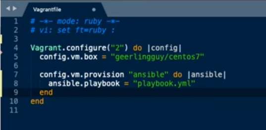

# Quick notes

<https://www.digitalocean.com/community/tutorials/how-to-install-and-configure-ansible-on-ubuntu-20-04-es>

- add files to main host file: `/etc/ansible/hosts`

```txt
[servers]
server1 ansible_host=203.0.113.111
server2 ansible_host=203.0.113.112
server3 ansible_host=203.0.113.113

[all:vars]
ansible_python_interpreter=/usr/bin/python3
```

- vi main inventory list: `ansible-inventory --list -y`
- test connection: `ansible all -m ping -u root`
- adhoc commands: `ansible all -a "df -h" -u root`

## Jeff Geerling

`pip3 install ansible`

inventory files be like:

```yaml
[example]   # inventory group
<ip>        # list server ips
```

`ansible -i inventory example -m ping -u <user>`

### ad hoc commands

`ansible example -a "free -h" -u <user>`

### vagrant

- `vagrant init <imagename>` creates a new file: vagrant init geerlingguy/centos7. RUBY.
- `vagrant up` - pulls the image and creates a vm as indicated in the file
- `vagrant ssh`
- `vagrant halt`
- `vagrant destroy`
- run a playbook using vagrant



- `vagrant provision` will look for playbook called "playbook.yml"

### playbooks

this is a _play_

```yaml
---
- hosts: all
  become: yes
  tasks:
    - name: Ensure NTP is installed
      yum: name=ntp state=present
    - name: Ensure NTP is running
      service: name=ntp state=started enabled=yes
```
