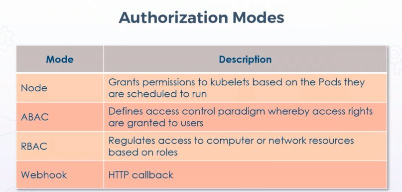
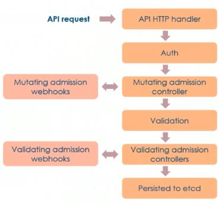
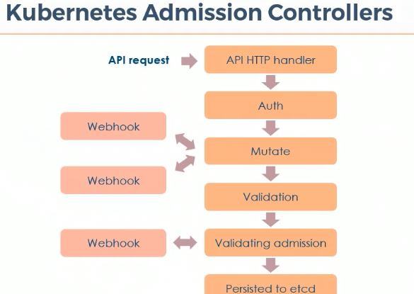
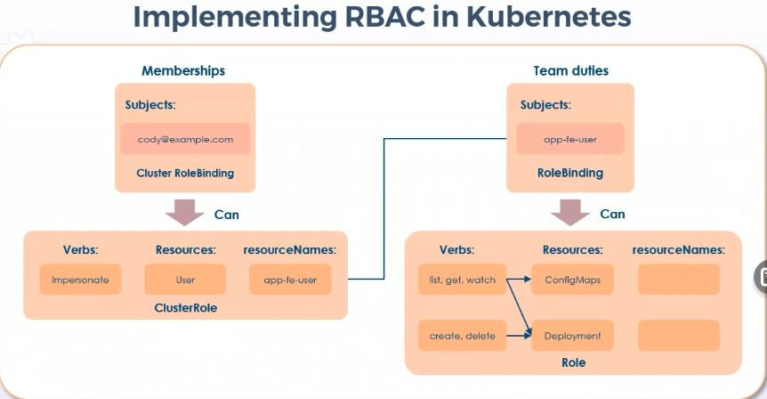
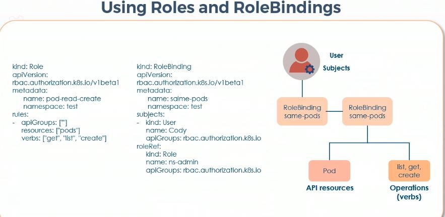
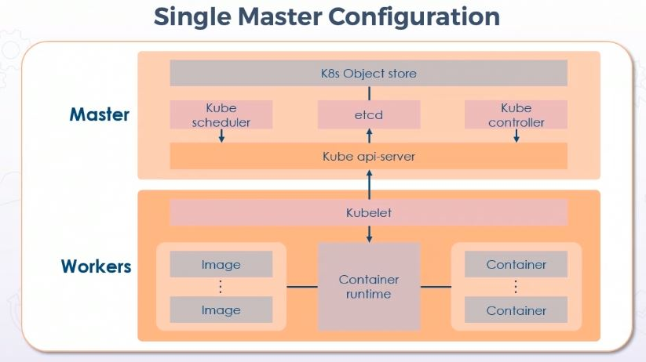
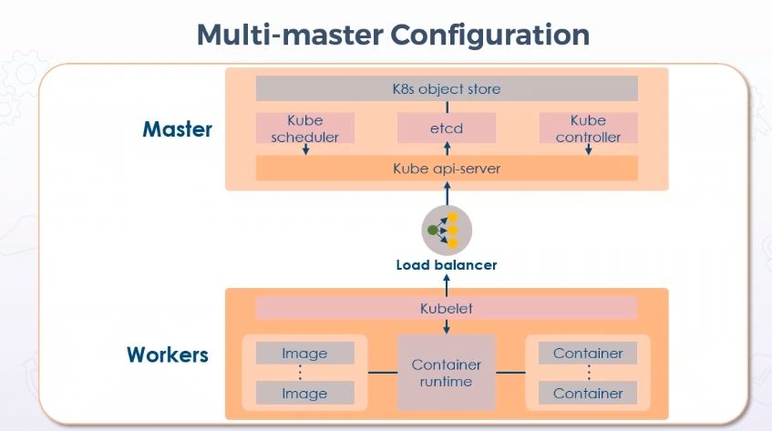

# k8s DXC course

<https://dxc.percipio.com/channels/88c14df0-cee2-11e7-b717-977a4c138a33>

## Bootstrapping k8s cluter with kubeadm

```console
sudo apt update -y
sudo apt install -y apt-transport-https curl
sudo curl -s <urlforGPG> | sudo apt-key add -
sudo vi /etc/apt/sources.list.d/kubernetes.list
    # deb https://apt.kubernetes.io/ kubernetes-xenial main
sudo apt update -y
sudo apt install -y kubelet kubeadm kubectl

sudo apt install -y docker.io
sudo systemctl start docker
sudo systemctl status docker
sudo systemctl enable docker
curl -s <gpgurl> | sudo apt-key add - <<---adding a key
vi /etc/apt/sources.list.d/kubernetes.list
    # deb http://apt.kubernetes.io/ kubernetes-xenial main
sudo apt update -y
sudo apt install -y kubelet kubeadm kubectl kubernetes-cni
<<<<< DISABLING SWAP >>>>>
sudo swapoff -a
sudo vi /etc/fstab
<<<<< INITIALIZING CLUSTER >>>>>
sudo kubeadm init
mkdit -p $HOME/.kube
sudo cp -i /etc/kubernetes/admin.conf $HOME/.kube/config
sudo chown $(id -u):$(id -g) $HOME/.kube/config
<<<<< ON NODES >>>>>
<<<<< JOINING WORKERS >>>>>
kubeadm join --token <value> <ipaddress>:<port>
kubectl version --client
kubectl config view
<<<<< COMMUNICATION WITH DIFFERENT CLUSTERS >>>>>
kubectl config --kubeconfig=<nameOfFile> set-cluster <k8sclusterName> --server=https://<k8sIP> --certificate-authority=ca.crt
kubectl config --kubeconfig=<nameOfFile> set-cluster <k8sclusterName> --server=https://<k8sIP> --insecure-skip-tls-verify
<<<<< add user t >>>>>
kubectl config --kubeconfig=<file> set-credentials <username> --client-certificate=ca.cert --client-key=ca.key 
<<<< files need to be on the node >>>>
<<<< add context >>>>
kubectl config --kubeconfig=<file> set-context kubernetes-admin@<k8sserver> --cluster=<clustername> --namespace=<namespacename> --user=<username>
kubectl config --kubeconfig=<nameOfConfigFile> view
<<<<< SET CONTEXT >>>>>
kubectl config --kubeconfig=<file> use-context kubernetes-admin@kubernetes
```

prepare k8s master for flannel

```console
modprobe bridge
echo "net.bridge.bridge-nf-call-iptables=1" >> /etc/sysctl.conf
sysctl -p /etc/sysctl.conf
wget <flannelurl>
<<<<< MODIFY FLANNEL MANIFEST FILE >>>>>
vi kube-flannel.yml
```

```yml
net-conf.json:
{
    "Network": "172.31.17.67/16",
    "Backend": {
        "Type": "vxlan",
        "VNI": 4096,
        "Port": 4789
    }
}
```

```console
kubectl apply -f <flannelconfig file>
kubectl get pods -n kube-system
    # search for flannel
```

create token for worker node: `kubeadm token create --print-join-command`

### kubectl in proxy mode

```console
kubectl describe secret
<<<<< get token for default user account >>>>>
APISERVER=$(kubectl config view --minify | grep server | cut -f 2- -d ":" | tr -d " ")
SECRET_NAME=$(kubectl get secrets | grep ^default | cut -f1 -d ' ')
TOKEN=$(kubectl describe secret $SECRET_NAME | grep -E '^token' | cut -f2 -d ':' | tr -d " ")
curl $APISERVER/api --header "Authorization: Bearer $TOKEN" --insecure
```

using kubectl proxy

```console
kubectl proxy --port=8080
```

### namespaces limitrange and pods

k8s has the ability to support multiple virtual clusters, maybe on the same physical cluster - these virtual clusters are called _namespaces_. The primary objective of namespaces is to enable the use of multiple environments for many users. We use namespaces in order to provide scope for all the names we are using for resources.

```console
kubectl get namespace
kubectl create namespace <nameOfNamespace>
```

memory tune

```yml
apiVersion: v1
kind: LimitRange
metadata:
    name: mem-limit-range
spec:
    limits:
    - defaults:
        memory: 512Mi
      defaultRequest:
        memory: 256Mi
      type: Container
```

`kubectl apply -f <file>.yml --namespace=<name>`

Containers created in the name space will have that memory limit (if they don't have memory specified)

pod config

```yml
apiVersion: v1
kind: Pod
metadata:
    name: default-mem-demo
spec:
  containers:
  - name: default-mem-demo-container
    image: nginx
```

create pod: `kubectl apply -f <file>.yml --namespace=<namespace>`

`kubectl get pod default-mem-demo --output=yaml --namespace=<namespace>`

### labels and annotations

labels: key value pairs attached to objects to identify them; created via yaml or kubectl command (`kubectl run <developmentname> --image=<imagename> --replicas=<#ofreplicas> --labels="<key>=<value>, <key>=<value>"`)

label selectors:

- `kubectl get pods --show-labels`
- `kubectl label pods labelexample type=preproduction` manage daemons
- `kubectl get pods --selector type=preproduction`

## Managing Role-based Access Control

A **Role** can only be used to grant access to resources within a single namespace. Example: List all pods in a namespace

A **ClusterRole** can be used to grant the same permissions as a Role, but because they are cluster-scoped.

- roles and role bindings are placed inside of and grant access to a specific namespace
- cluster roles and cluster role bindings do not belong to a namespace and grant access across the entire cluster

Authorization in k8s: method to regulate access to computer or network resources; auth uses rbac.Authorization.K8s.Io



- abac auth: access rights are granted to users using policies. essential attributes
- rbac: enable by default; permissions need to be especifically granted (users start without permissions); 1) roles 2) cluster roles 3) subject
- webhook auth; generate query outside REST sersvice. mutating and validating webhook.



A client sends a request to k8s API server and sends two sets of information:

1. username, id, group: goes to authentication. verify username and user account, known to the cluster; after authentication, authorization: allowed or not?
2. path, resource, verb, namespace: goes to admission; final step

k8s admin controllers; plugins to enforce how the cluster is used; it's a gatekeeper controller that intercepts requests to allow access or deny it.



querying API auth layer

```console
kubectl auth can-i create deployments
kubectl get namespaces
kubectl auth can-i create deployments --namespace <namespace>
```

turn on admission controller

```console
kubectl get pods
kubectl get pods -n <namespace>
vi /etc/kubernetes/manifests/kube-apiserver.yaml
```

Search for line `--enable-admission-plugins`. Change the value to `NamespaceLifecycle,LimitRanger,NodeRestriction` to "allow"/"configure" plugins; now to apply the plugin: `kubectl apply -f /etc/kubernetes/manifests/kube-apiserver.yml` - it creates a pod.

### k8s rbac

- subject
- resources
- verbs - operations that can be executed on the resources

Principles of least privilege: apps have least priviledge than infra.

allow subject to impersonate another user id.



use delegate to share access

RoleBinding: will connect remaining entity subjects that are not specified in roles



Defining rules in a role

```yml
rules:
- apiGroups: [""]
  resources: ["pods"]
  verbs: ["get", "list", "watch"]
- apiGroups: ["batch", "extensions"]
  resources: ["jobs"]
  verbs: ["get", "list", "watch", "create", "update", "patch", "delete"]
```

- cluster role: set of permissions assigned to resources in a cluster
- cluster role binding: grants permissions definied in a role to a user. holds a list of subjects.

creating a role:

```yml
apiVersion: app/v1
kind: Role
metadata:
  namespace: default
  name: podsrole
rules:
- apiGroups: [""]
  rsources: ["pods"]
  verbs: ["get", "watch", "list"]
```

```console
kubectl apply -f <filename>
kubectl get roles
```

creating role binding - grant permissions defined in a role to a user or set of users

```console
kubectl describe role <roleName>
```

specify rolebinding configuration

```yml
apiVersion: rbac.authorization.k8s.io/v1
kind: RoleBinding
metadata:
  name: read-pods
  namespace: default
subjects:
- kind: User
  name: cody # "name" is case sensitive
  apiGroup: rbac.authorization.k8s.io
roleRef:
  kind: Role
  name: podsrole
  apiGroup: rbac.authorization.k8s.io
```

```console
kubectl describe role <roleName>
kubectl apply -f <fileNameOfRolebinding>
kubectl describe rolebinding <rbname> 
```

Creating cluster role - not namespaced, applied at cluster scope

```yml
apiVersion: rbac.authorization.k8s.io/v1
kind: ClusterRole
metadata:
  name: secretmanager
rules:
- apiGroups: [""]
  resources: ["secrets"]
  verbs: ["get", "watch", "list"]
```

```console
kubectl apply -f <fileNameOfClusterRole>
```

Cluster role binding to read secrets

```yml
apiVersion: rbac.authorization.k8s.io/v1
kind: ClusterRole
metadata:
  name: secretmanager1
rules:
- apiGroups: [""]
  resources: ["secrets"]
  verbs: ["get", "watch", "list"]
---
apiVersion: rbac.authorization.k8s.io/v1
kind: ClusterRoleBinding
metadata:
  name: secretbindings
subjects:
- kind: Group
  name: manager
  apiGroup: rbac.authorization.k8s.io
roleRef:
  kind: ClusterRole
  name: secretemanager1
  apiGroup: rbac.authorization.k8s.io
```

```console
kubectl apply -f <clusterrolebindingfile>
```

```console
kubectl get roles
kubectl get roles --namespace=<namespaceName>
kubectl get roles --all-namespaces
kubectl get clusterroles
kubectl get rolebindings --namespace=<namespaceName>
kubectl describe rolebinding <rolebindingName>
```

allow users to perform ops in a namespace using `kubeconfig`

```yml
apiVersion: rbac.authorization.k8s.io/v1
kind: Role
metadata:
  namespace: c3objects
  name: podsrole_n
rules:
- apiGroups: [""]
  resources: ["pods"]
  verbs: ["get", "watch", "list"]

---
apiVersion: rbac.authorization.k8s.io/v1
kind: RoleBinding
metadata:
  name: read-pods
  namespace: c3objects
subjects:
- kind: User
  name: cody
  apiGroup: rbac.authorization.k8s.io
```

```console
kubectl create namespace <namespaceName>
kubectl apply -f <file>
```

aggregated cluster roles in k8s

```yml
apiVersion: rbac.authorization.k8s.io/v1
kind: ClusterRole
metadata:
  name: clusterrole1
  labels:
    agregate: "true"
rules:
- apiGroups: [""]
  resources: ["pods", "services"]
  verbs: ["get", "watch", "list"]
---
apiVersion: rbac.authorization.k8s.io/v1
kind: ClusterRole
metadata:
  name: clusterrole2
aggregationRule:
  clusterRoleSelectors:
  - matchLabels:
      aggregate: "true"
```

```console
kubectl apply -f <aggregateClusterRoleFileName>
```

### youtube

<https://www.youtube.com/watch?v=BLktpM--0jA>

namespaces "create partitions"

<https://youtu.be/VTADZjL_psI>

roles para declarar permisos que afectan a namespaces

- recursos - pods, volumes, namespaces...
- verbos - acciones a hacer los recursos

cluster role - permiso para todo el cluster

para poder asignar los permisos a usuarios o grupos tenemos que hacer un role binding - 
junta un usuario/grupo con un rol; lo mismo si queremos dar permiso a todo un cluster
tenemos que hacer un cluster role binding. elementos de role binding

- role
- subject
- service account

para darle permiso a un pod, tenemos que crear un service account

los roles permiten cosas - por defecto se niega todo

```console
kubectl create namespace office
openssl genrsa -out employee.key 2048		<-- creamos una key
openssl req -new -key employee.key -out employee.csr -subj "/CN=employee/O=bitnami" 	<-- creamos certificate signing request
openssl x509 -req -in employee.csr -CA ~/.minikube/ca.crt -CAkey ~/.minikube/ca.key -CAcreateserial -out employee.crt	< -- firmar el CSR
kubectl config set-credentials employee --client-certificate=employee.crt --client-key=employee.key	<-- crear usuario
kubectl config set-context employee-context --cluster=minikube --namespace=office --user=employee <-- crear contexto
kubeselect <-- selecionar contexto que acabamos de crear
```

crear role

```yml
kind: Role
apiVersion: rbac.authorization.k8s.io/v1
metadata:
  namespace: office # esto hace que sea un mero rol, no un CLUSTER role
  name: deployment-manager
rules:
- apiGroups: ["", "extensions", "apps"]
  resources: ["deployments", "replicasets", "pod"]
  verbs: ["get", "list", "watch", "create", "update", "patch", "delete"] # también se puede usar ["*"]
```

```console
kubeselect - cambiar al usuario administrador
kubectl apply -f <filename.yml>
```

crear role binding - vim rolebinding.yml

```yml
kind: RoleBinding
apiVersion: rbac.authorization.k8s.io/v1
metadata:
  name: deployment-manager-binding
  namespace: office
subjects:
- kind: User
  name: employee
  apiGroup: ""
roleRef:
  kind: Role
  name: deployment-manager
  apiGroup: ""
```

kubectl apply -f rolebinding.yml

crear service account

```yml
apiVersion: v1
kind: ServiceAccount
metadata:
  name: node-exporter
  namespace: monitoring
```

crear cluster role binding

```yml
kind: ClusterRoleBinding
apiVersion: rbac.authorization.k8s.io/v1
metadata:
  name: tiller-culterrolebinding
subjects:
- kind: ServiceAccount
  name: tiller
  namespace: kube-system
roleRef:
  kind: ClusterRole
  name: cluster-admin
  apiGroup: ""
```

## managing HA clusters

kubeadm: tool to creat clusters.

- kubeadm init: bootstrap k8s control-plane node
  - preflight: run preflight checks
  - kubelet-start: write kubelet settings and restart kubelet
  - certs: generate certificates for k8s cluster
  - kubeconfig: generate all kubeconfig files for control plane and amdin kubeconfig file
  - control-plane: generate all static Pod manifest files required to establish control plane
  - etcd: generate static Pod manifest file for local etcd
  - upload-config: uploads currently used config for kubeadm to ConfigMap
  - mark-control-plane: mark nodes as control-plane
  - bootstrap-token: manages kubeadm-specific bootstrap token function
  - addon: installs addon for passing conformance tests
- kubeadm join: bootstrap k8s worker node and join it to the cluster
- kubeadm upgrade: upgrade k8s cluster to newer version
- kubeadm config: configure cluster for kubeadm upgrade
- kubeadm token: manage tokens to join workers
- kubeadm reset: revert any host changes
- kubeadm version: print kubeadm version
- kubeadm alpha: preview set of features made available for gathering feedback

1. Single master config - k8s cluster has 1 master and multiple workers; wn connect and communicate with master API server. if master is not available, SPOF <-- not HA

2. mult-master config - wn can connect to any master k8s api server user HA load balancer


Masters try to acquire "_lease_".
