# CKA

## Links

- <https://www.cncf.io/certification/cka/>
- <https://github.com/cncf/curriculum>
- <https://www.cncf.io/certification/candidate-handbook>
- <http://training.linuxfoundation.org/go//Important-Tips-CKA-CKAD>
- <https://github.com/kodekloudhub/certified-kubernetes-administrator-course>

## Core Concepts

We're going to use an analogy of ships to understand the architecture of Kubernetes.

The purpose of Kubernetes is to host your applications in the form of containers in an automated fashion

so that you can easily deploy as many instances of your application as required and easily enable communication between different services within your application.
So there are many things involved that work together to make this possible.

So let's take a 10000 feet look at the Kubernetes architecture.

We have two kinds of ships.

1. _cargo ships_ that does the actual work of carrying containers across to sea and
2. _control ships_ that are responsible for monitoring and managing the cargo ships.

The **Kubernetes cluster** consists of a set of nodes which may be physical or virtual, on-premise or on cloud, that host applications in the form of containers. These relate to the cargo ships. In this analogy, the worker nodes in the cluster are ships that can load containers.

But somebody needs to load the containers on the ships and not just load plan how to load identify the right ships store information about the ships monitor and track the location of containers on the ships manage the whole loading process etc..

This is done by the control ships that host different offices and departments monitoring equipments communication equipments cranes for moving containers between ships etc.

The control ships relate to the master node in the Kubernetes cluster. The master node is responsible for managing the Kubernetes cluster storing information regarding the different nodes planning which containers cause where monitoring the notes and containers on them etc. _The Master node does all of these using a set of components together known as the control plane components_.

Now there are many containers being loaded and unloaded from the ships on a daily basis. And so you need to __maintain information about__ the different ships __what container is on which ship and what time it was loaded__ etc. **All of these are stored in a highly available key value store known as Etcd**. The Etcd is a database that stores information in a key-value format. We will look more into what Etcd cluster actually is what data is stored in it and how it stores the data in one of the upcoming lectures.

When ships arrive you load containers on them using cranes the cranes identify the containers that need to be placed on ships. It identifies the right ship based on its size its capacity the number of containers already on the ship and any other conditions such as the destination of the ship. The type of containers it is allowed to carry etc. So those are **schedulers in a Kubernetes cluster** as scheduler **identifies the right node to place a container on based on the containers**.

Resource requirements the worker nodes capacity or any other policies or constraints such as tents and tolerations or node affinity  rules that are on them. We will look at these in much more detail with examples and practice tests later in this course. We have a whole section on scheduling alone.

There are different offices in the dock that are assigned to special tasks or departments. For example the operations team takes care of ship handling traffic control etc. they deal with issues related to damages the routes the different ship state etc. The cargo team takes care of containers when continuous are damaged or destroyed. They make sure new containers are made available. You have these services office that takes care of the I.T. and communications between different ships. Similarly, in Kubernetes we have controllers available that take care of different areas.

The **node-controller** takes care of nodes. They're responsible for onboarding new nodes to the cluster handling situations where nodes become unavailable or get destroyed and the replication controller ensures that the desired number of containers are running at all times in your replication group.

So we have seen different components like the different offices the different ships the data store the cranes. But _how do these communicate with each other_? How does one office reach the other office and who manages them all at a high level.

**The kube-apiserver is the primary management component of kubernetes. The kube-api server is responsible for orchestrating all operations within the cluster**. _It exposes the Kubernetes API which is used by externals users to perform management operations_ on the cluster as well as the various controllers to monitor the state of the cluster and make the necessary changes as required and by the worker nodes to communicate with the server.

Now we are working with containers here. Containers are everywhere so we need everything to be container compatible. Our applications are in the form of containers the different components that form the entire management system. On the master nodes could be hosted in the form of containers.

The DNS service networking solution can all be deployed in the form of containers. So we need these **software that can run containers and that's the container runtime engine. A popular one being Docker. So we need Docker or it's supported equivalent installed on all the nodes in the cluster including the master nodes.** if you wish to host the control plane components as containers. Now it doesn’t always have to be Docker.

Kubernetes supports other run time engines as well like ContainerD or Rocket.

let's now turn our focus onto the cargo ships. Now every ship has a captain. The captain is responsible for managing all activities on these ships. The captain is responsible for liaising with the master ships starting with letting the master ship know that they are interested in joining the group receiving information about the containers to be loaded on the ship and loading the appropriate containers as required sending reports back to the master about the status of this ship and the status of the containers on the ship etc.

Now the captain of the ship is the **kubelet** in Kubernetes. **A kubelet is an agent that runs on each node in a cluster. It listens for instructions from the kube-api server and deploys or destroys containers on the nodes as required. The kube-api server periodically fetches status reports from the kubelet to monitor the state of nodes and containers on them.**

The kubelet was more of a captain on the ship that manages containers on the ship. But the _applications running on the worker nodes need to be able to communicate with each other_. For example you might have a web server running in one container on one of the nodes and a database server running on another container on another node. How would the web server reach the database server on the other node?

**Communication between worker nodes are enabled by another component that runs on the worker node known as the Kube-proxy service. The Kube-proxy service ensures that the necessary rules are in place on the worker nodes to allow the containers running on them to reach each other.**

So to summarize we have:

- **master** and **worker nodes**
  - on the master. We have the
    - **ETCD cluster** which stores information about the cluster
    - the **Kube scheduler** that is responsible for scheduling applications or containers on Nodes
    - We have different controllers that take care of different functions like the node control, replication, controller etc..
    - we have the **Kube api server** that is responsible for orchestrating all operations within the cluster.
  - on the worker node.
    - we have the **kubelet** that listens for  instructions from the Kube-apiserver and manages containers and
    - the **kube-proxy** That helps in enabling communication between services within the cluster.


So that's a high level overview of the various components.

### ETCD in k8s

In this lecture we will talk about ETCD’s role in kubernetes.

ETCD is a distributed reliable key-value store that is Simple, Secure & Fast. Used to store and retrieve small chunks of data, such as config data that requires fast read and write.

1. Download binaries
2. extract
3. run ETCD Service; it uses port 2379

etcdctl --> command to interact with etcd key-value store: `etcdctl set key1 value1`. to get data: `etcdctl get key1`.

The ETCD datastore stores information regarding the cluster such as the nodes, pods, configs, secrets, accounts, roles, bindings and others.

_Every information you see when you run the kubectl get command is from the ETCD server_. Every change you make to your cluster, such as adding additional nodes, deploying pods or replica sets are updated in the ETCD  server. Only once it is updated in the ETCD server, is the change considered to be complete.

Depending on how you setup your cluster, ETCD is deployed differently. Throughout this section we discuss about two types of kubernetes deployment. One deployed from scratch, and other using kubeadm tool.  

The practice test environments are deployed using the kubeadm tool and later in this course when we set up a cluster from scratch so it's good to know the difference between the two methods; if you set up your cluster from scratch then you deploy ETCD by downloading the ETCD binaries yourself, installing the binaries and _configuring ETCD as a service_ in your master node yourself. There are many options passed into the service a number of them relate to certificates (we will learn more about these certificates how to create them and how to configure them later in this course - we have a whole sectionon TLS certificates). The others are about configuring ETCD as a cluster.

We will look at those options when we set up high availability in kubernetes the only option to note for now is the **advertised client url**. This is the address on which ETCD listens. It happens to be on the IP of the server and on **port 2379, which is the default port on which etcd listens**. _This is the URL that should be configured on the kube-api server when it tries to reach the etcd server_.

If you setup your cluster using kubeadm then kubeadm deploys the ETCD server for you as a POD in the kube-system namespace. You can explore the etcd database using the _etcdctl_ utility within this pod. To list all keys stored by kubernetes, run the `etcdctl get` command like this. Kubernetes stores data in the specific directory structure the root directory is a registry and under that you have the various kubernetes constructs such as minions or nodes, pods, replicasets, deployments etc.

In a high availability environment you will have multiple master nodes in your cluster then you will have multiple ETCD instances spread across the master nodes. In that case, make sure to specify the ETCD instances know about each other by setting the right parameter in the ETCD service configuration. The initial-cluster option is where you must specify the different instances of the ETCD service.

etcdctl can interact with etcd server using 2 API versions, version 2 (default) and version 3.

| etcdctl v2 | etcdctl v3 |
| ------- |--------|
|etcdctl bakcup | etcdctl snapshot save |
| etcdctl cluster-health | etcdctl endpopint health |
| etcdctl mk | etcdctl get |
| etcdctl mkdir | etcdctl put |
| etcdctl set | |

to set the right version of API, set the environment variable ETCDCTL_API: `export ETCDCTL_API=3`. also, you must specify the path to certificate files so that ETCDCTL can authenticate to the ETCD API server. the certificate files are available in the etcd-master at:

- --cacert /etc/kubernetes/pki/etcd/ca.crt
- --cert /etc/kubernetes/pki/etcd/server.crt
- --key /etc/kubernetes/pki/etcd/server.key

specify etcdctl api version and path certificate files: `kubectl exec etcd-master -n kube-system -- sh -c "ETCDCTL_API=3 etcdctl get / --prefix --keys-only --limit=10 --cacert /etc/kubernetes/pki/etcd/ca.crt --cert /etc/kubernetes/pki/etcd/server.crt  --key /etc/kubernetes/pki/etcd/server.key"`

### kube-api server

In this lecture we will talk about the Kube-API server in kubernetes.

Earlier we discussed that the Kube-api server is the _primary management component in kubernetes_.  When you run a `kubectl command`, **the kubectl utility is infact reaching to the kube-apiserver**. The kube-api server first authenticates the request and validates it. It then retrieves the data from the ETCD cluster and responds back with the requested information.

You don’t really need to use the kubectl command line. Instead, you could also invoke the API directly by sending a post request.

let's look at an example of creating a pod. when you do that the request is authenticated first and then validated. In this case:

1. the API server creates a POD object without assigning it to a node,
2. updates the information in the ETCD server
3. updates the user that the POD has been created.
4. The scheduler continuously monitors the API server and realizes that there is a new pod with no node assigned
5. the scheduler identifies the right node to place the new POD on and communicates that information  back to the kube-apiserver.
6. The API server then updates the information in the ETCD cluster.
7. The API server then passes that information to the kubelet in appropriate worker node.
8. The kubelet then creates the POD on the node and instructs the container runtime engine to deploy the application image.
9. Once done,  the kubelet updates the status back to the API server and
10. the API server then updates the data back in the ETCD cluster.

A similar pattern is followed every time a change is requested. **The kube-apiserver is at the center of all the different tasks that needs to be performed to make a change in the cluster**.

To summarize, the kube-api server is responsible for Authenticating and validating requests, retrieving and updating data in ETCD data store. in fact, _kube-api server is the only component that interacts directly with the etcd datastore_. The other components such as the scheduler, kube-controller-manager & kubelet uses the API server to perform updates in the cluster in their respective areas.

If you bootstrapped your cluster using kubeadm tool then you don't need to know this but if you are setting up the hard way, then kube-apiserver is available as a binary in the kubernetes release page. Download it and configure it to run as a service on your kubernetes master node. The kube-api server is run with a lot of parameters. Throughout this section we are going to take a peak at how to install and configure these individual components of the kubernetes architecture.

You don't have to understand all of the options right now but I think having a high level understanding on some of these now will make it easier later when we configure the whole cluster and all of its components
from scratch.

The kubernetes architecture consists of a lot of different components working with each other, talking to each other in many different ways so they all need to know where the other components are. There are different modes of authentication, authorization, encryption and security. And that’s why you have so many options.

When we go through the relevant section in the course we will pull up this file and look at the relevant options.

A lot of them are certificates that are used to secure the connectivity between different components.

_The option ETCD-servers `etcd-servers=https://127.0.0.1:2379` is where you specify the location of the ETCD servers. This is how the kube-api server connects to the etcd servers._

So how do you view the kube-api server options in an existing cluster? It depends on how you set up your cluster.

If you set it up with kubeadm tool, kubeadm deploys the kube-api server as a pod in the kube-system namespace on the master node you can see the options within the pod definition file located at /etc/kubernetes/manifests folder.

In a non kubeadm setup, we can view the options of the kube-apiserver service located at /etc/systemd/system/kube-apiserver.service.You can also see the running process and the effective options by listing the process on the master node and searching for kube-apiserver `ps aux | grep kube-apiserver`.

### kube controller manager

we will talk about Kube Controller Manager.

As we discussed earlier, the kube controller manager manages various controllers in Kubernetes. A controller is like an office or department within the master ship that have their own set of responsibilities. Such as an office for the Ships would be responsible for monitoring and taking necessary actions about the ships. Whenever a new ship arrives or when a ship leaves or gets destroyed another office could be one that manages the containers on the ships they take care of containers that are damaged or full of ships.

So these officers are

1. continuously on the lookout for the status of the ships and
2. take necessary actions to remediate the situation.

**In the kubernetes terms a controller is a process that continuously monitors the state of various components within the system and works towards bringing the whole system to the desired functioning state**. For example the __node controller__ is responsible for monitoring the status of the nodes and taking necessary actions to keep the application running. **It does that through the kube-api server**.

The node controller checks the status of the nodes **every 5 seconds**. That way the node controller can monitor the health of the nodes - if it stops receiving heartbeat from a node the node is marked as **unreachable** but it waits for 40 seconds before marking it unreachable. after a node is marked unreachable it gives it five minutes to come back up - if it doesn’t, it removes the PODs assigned to that node and provisions them on the healthy ones if the PODs are part of a replica set

The next controller is the **replication controller**. It is responsible for monitoring the status of replica sets and ensuring that the desired number of PODs are available at all times within the set. _If a pod dies it creates another one_.

Now those were just two examples of controllers. There are many more such controllers available within kubernetes. Whatever concepts we have seen so far in kubernetes such as deployments, Services, namespaces, persistent volumes and whatever intelligence is built into these constructs it is implemented through these various controllers.

As you can imagine this is kind of the brain behind a lot of things in kubernetes. Now how do you see these controllers and where are they located in your cluster. _They're all packaged into a single process known as_ **kubernetes controller manager**. When you install the kubernetes controller manager the different controllers get installed as well.

So how do you install and view the kubernetes Controller manager? download the kube-controller-manager from the kubernetes release page. Extract it and run it as a service.
When you run it as you can see there are a list of options provided this is where you provide additional options to customize your controller.

Remember: some of the default settings for node controller we discussed earlier such as the node monitor period, the grace period and the eviction  timeout. These go in here as options.

There is an additional option called controllers that you can use to specify which controllers to enable. By default all of them are enabled but you can choose to enable a select few. So in case any of your controllers don't seem to work or exist this would be a good starting point to look at.

So how do you view the Kube-controller-manager server options? Again it depends on how you set up your cluster.

If you set it up with kubeadm tool, kubeadm deploys the kube-controller-manager as a pod in the kube-system namespace on the master node. You can see the options within the pod definition file located at etc/kubernetes/manifests folder.

In a non-kubeadm setup, you can inspect the options by viewing the kube-controller-manager service located at the services directory. You can also see the running process and the effective options by listing the process on the master node and searching for kube-controller-manager `ps aux | grep kube-controller-manager`.

### kube scheduler

Only responsible for deciding which pod goes on which nodes; it doesn't place the pods on the nodes. that's the job of the kubelet; the kubelet, the captain of the ships, is who creates the pods on the ships.

Scheduler is used to decide which nodes the pods are placed on, depending on certain criteria. for instance pod dedicated to a specific application within the cluter.

the scheduler looks at each pods and tries to find the best node for it. for example, cpu requirements. the scheduler

1. filters the nodes that do not fit the profile for a pod
2. ranks the nodes to identify the best fit for the pod - priority function to give a score to the node. it ranks nodes higher based on the amount of resources that would be free if the pod is placed on the node (say, requirement is 10 cpus, and there are 2 nodes, **A** with 12 nodes and **B** with 16 nodes; node B would be ranked higher because there would be 6 free cpus in case the 10 cpu pod is assigned to it)

Installing - download, isntall and run as a service.

### kubelet

the kubelet in the worker nodes registers the nodes with the k8s cluster. when it receives instruction to load a container or pod on the nodes, it requests the container runtime engine to pull the required image and run an isntance of it.

The kubelet also monitors the status of the POD and containers in it and reports to the kube-api server.

- register the node
- create PODs
- monitor node and PODs

installing kubectl:

- kubeadm installation method: kubeadm k8s deployment does not install the kubelet.
- manual install - kubelet has to be manually isntalled always - download installer, extract it and run it as a service. `ps aux | grep kubelet`

### kube proxy

in a k8s cluster, any pod can reach any other pod - this is accomplished by using a pod networking solution to the cluster. a pod network is an internal virtual network that spans accross all the nodes in the cluster to which all the pods connect to.

it's better to use a service, which maintains the ip address, to ensure communication between nodes and pods.

kube-proxy is a process that runs on each node in the k8s cluster. it's job is to look for new services and each time a new service is created, it creates the appropriate rule to forward traffic to those services to the backend pods by using ip table rules.

download the binaries, install and run as a service. the kubeadm tool deploys kube proxy as a pod, as a daemon set.

### pod

containers are encapsulated into a k8s object known as PODs. a POD is a single instance of an application. a POD is the smallest object that you can create in k8s.

PODs usually have a one to one relationship with containers running the app. you do not add additional containers to an existing POD to escale your app; you create a new POD - or delete the POD (escale down). from the outside to the in

1. cluster
2. node
3. pod
4. container

a single POD can have multiple containers, but not multiple containers of the same kind. we might have _helper containers_. supporting tasks for app, processing user data, a file... if a new POD is created, helper container is created as well.

containers can communicate with each other using localhost (loopback nic), same network space, and storage space.

how to deply pods: `kubectl run nginx --image nginx`. it creates a pod and deploys an image of the nginx docker image. it gets the image from the dockerhub repository. it can also be configured to pull images from a local repository.

`kubectl get pods` -- see pods and status - `kubectl describe pod <podname>`

### pods with yaml

k8s uses yaml files as inputs for the creation of k8s objects. required structure:

- apiVersion <-- version of the k8s api version we are using to create the object - regularly for working for pods `v1`; for services `v1`, replicaSet `apps/v1`, deployment `apps/v1`
- kind <-- type of object we are trying to create - Pod, Service, ReplicaSet, Deployment
- metadata <-- data about the object, it's *name*, *labels*, etc... form of dictionary
- spec <-- additional info about the object we are creating.

Once the file is done `kubectl create -f <file>`

```yml
apiVersion: v1
kind: Pod
metadata:
  name: myapp-pod
  labels:
    app: myapp
spec:
  containers:
    - name: nginx-container
      image: nginx
    # - name: backend-container
    #   image: redis
```

### replica sets

controllers: the processes that monitor k8s objects and respond accordingly. **Replicatoin Controller**. it helps to run multiple instance of a single pod in the k8s cluster, thus providing HA. even if you have a single pod the replication controller can help by automatically bringing up a new pod when the existing pod fails. the replication controller ensures that the specified number of pod are running at all times.

RC is also used to share the load between containers - RC can create pods on other nodes as well. The replication controller is older technology, being replaced by **replica sets**. replica sets is the new recommended way of setting up replication.

creating a replication controller:

```yml
apiVersion: v1
kind: ReplicationController
metadata:
  name: myapp-rc
  labels:
    app: myapp
    type: front-end
spec:
  template:
    metadata:
      name: myapp-pod
      labels:
        app: myapp
    spec:
      containers:
        - name: nginx-container
          image: nginx
  replicas: 3
```

- `kubectl create -f <file>`
- `kubectl get replicationcontroller`

what is a replica? a copy of a pod

```yml
apiVersion: apps/v1
kind: ReplicaSet
metadata:
  name: myapp-replicaset
  labels:
    app: myapp
    type: front-end
spec:
  template:
    metadata:
      name: myapp-pod
      labels:
        app: myapp
    spec:
      containers:
        - name: nginx-container
          image: nginx
  replicas: 3
  selector:
    matchLabels:
      type: front-end
```

mayor difference with replication controller is the "selector" field: it identifies what pods fall under it. RS can also manage pods that were not created as part of the rs creation (pods created before applying the replica set). replica sets can be used to monitor existing pods.

- `kubect get replicaset`

Labels and selectors

**The role of the replica set** is to monitor the pod and in case any on them were to fail, deploy new ones. the rs is a process that monitors the pod. the replica set knows which pod to monitor through the labels attached to pods, defined under the selector field.

to escale the number of replicas, we can simply update the rs config file `kubectl replace -f <file>`; to do this task manually, we can run `kubectl scale --replicas=6 <file>` or `kubectl scale --replicas=6 <type> <rsName>`<-- this does not update the rs definition file.

We can also use `kubectl edit <replicasetName>`, update the configuration there and then delte de pods; as they are being deleted and recreated, they will pick up the new configuration.

### deployments

deployments are useful for

- deploying/creating new instances of an application
- updating an application (rolling updates)
- rolling back an update
- multiple changes to the environment (updating and creating new instances) - apply changes after a pause, then continue

deployments are k8s objects that are higher than replicasets. it allows for seamless update of the app.

creating a deployment through a definition file (similar to replica set):

```yml
apiVersion: apps/v1
kind: Deployment
metadata:
  name: myapp-deployment
  labels:
    app: myapp
    type: front-end
spec:
  template:
    metadata:
      name: myapp-pod
      labels:
        app: myapp
        type: front-end
    spec:
      containers:
        - name: nginx-container
          image: nginx
  replicas: 3
  selector:
    matchLabels:
      type: front-end
```

`kubectl create -f <deploymentFile>` <<-- the deployment creates a replica set (get deployments = 1, get replicasets = 1) which create pods.

`kubectl get all`

<https://linuxhandbook.com/kubectl-apply-vs-create/>

### creating yml files on the run

using `kubectl run` command can help in generating a yaml template. if your were asked to create a pod or deployment with specific name and image you can simply run the `kubectl run` command.

<https://kubernetes.io/docs/reference/kubectl/conventions/>

- creating an nginx pod: `kubectl run nginx --image=nginx`
- generate POD manifes yaml file (`-o yaml`) - don't create it (`--dry-run`): `kubectl run nginx --image=nginx --dry-run=client -o yaml`
- create a deployment: `kubectl create deployment --image=nginx nginx`
- generate deployment yaml file (`-o yaml`). don't create it (`--dry-run`): `kubectl create deployment --image=nginx nginx --dry-run=client -o yaml`
- generate deployment yaml file (`-o yaml`). don't create it (`--dry-run`) with 4 Replicas (`--replicas=4`): `kubectl create deployment --image=nginx nginx --dry-run=client --replicas=4 -o yaml > nginx-deployment.yaml`

we can create a new file and make necessary changes to it.

```console
root@controlplane:~# kubectl create deployment --image=httpd:2.4-alpine httpd-frontend --dry-run=client --replicas=3 -o yaml > own-file.yaml
root@controlplane:~# 
root@controlplane:~# 
root@controlplane:~# 
root@controlplane:~# 
root@controlplane:~# cat own-file.yaml 
apiVersion: apps/v1
kind: Deployment
metadata:
  creationTimestamp: null
  labels:
    app: httpd-frontend
  name: httpd-frontend
spec:
  replicas: 3
  selector:
    matchLabels:
      app: httpd-frontend
  strategy: {}
  template:
    metadata:
      creationTimestamp: null
      labels:
        app: httpd-frontend
    spec:
      containers:
      - image: httpd:2.4-alpine
        name: httpd
        resources: {}
status: {}
root@controlplane:~# kubectl create deployment --image=httpd:2.4-alpine httpd-frontend ^Creplicas=3 -o yaml > own-file.yaml
root@controlplane:~# kubectl get deployments
NAME                  READY   UP-TO-DATE   AVAILABLE   AGE
deployment-1          0/2     2            0           5m26s
frontend-deployment   0/4     4            0           17m
root@controlplane:~# kubectl create deployment --image=httpd:2.4-alpine httpd-frontend --replicas=3 -o yaml > own-file-r.yaml
root@controlplane:~# kubectl get deployments
NAME                  READY   UP-TO-DATE   AVAILABLE   AGE
deployment-1          0/2     2            0           5m52s
frontend-deployment   0/4     4            0           17m
httpd-frontend        0/3     3            0           4s
root@controlplane:~#
```

### namespaces

_default_ is the namespace that creates k8s. k8s creates a set of pods for internal purposes (networking solution, dns...) to isolate them from the user on another namespace named _kube-system_. a third namespace is created called _kube-public_; this is where resources that should be made available to all users are created.

resources on namespaces are isolated.

namespaces can have different sets of policies assigned, to define who can do what. you can also assign quotas/limits of resources to the namespaces.

resources within a namespace can refer to each other simply by their names (`mysql.connect("db-service"`). a pod can reach a resource on another namespace - we must append the name of the namespace to the name of the service (`mysql.connect("db-service.dev.svc.cluster.local")` <<<--- connecting from, say, default ns to dev ns). we can access the resources because a DNS entry is created when the service is created.

| db-service | dev | svc | cluster.local |
| ---------- | ---- |---- |--------- |
| service name | namespace | service | domain |

- to list pods on another ns: `kubectl get pods --namespace=<nsName>`
- create a pod on another ns: `kubectl create -f <file> --namespace=<nsName>` we can move this option directly to the pod definition file; under **metadata**, `namespace: dev` as a sibling of **name**. this ensures that resources are created on the same ns consistently.

creating a ns definition file

```yml
apiVersion: v1
kind: Namespace
metadata:
  name: dev
```

`kubectl create -f <fileName>`

Another way of creating a ns is by running `kubectl create namespace <nsName>`

to switch to another namespace: `kubectl config set-context $(kubectl config current-context) --namespace=dev`

to view pods on all ns: `kubectl get pods --all-namespaces`

contexts are used to manage multiple clusters and environments from the same management system.

to limit resources in a ns, create a _resource quota_

```yml
apiVersion: v1
kind: ResourceQuota
metadata:
  name: compute-quota
  namespace: dev
spec:
  hard:
    pods: "10"
    requests.cpu: "4"
    requests.memory: 5Gi
    limits.cpu: "10"
    limits.memory: 10Gi
```

`kubectl create -f <file>`

- `kubectl get ns`
- `kubectl -n research get pods` --> `-n` for namespace name

### services

services enable communication between components and outside the app. they help us connect apps with other apps/users.


services are k8s objects with many uses. one of then is to listen to a port on the node and forward requests on that port to a port on the pod running the web app.


we can't reach the web page on the POD, which has a private IP 10.244.0.2; we can create a service on the node that listens to requests on port XXX; once the node reciebes a request on a certain port, the service will "translate" the address and reach the pod.

this is known as a **node-port** service - the service listens to a port on the node and forwards requests to the POD.

1. node-port: the service makes an internal port accesible on a port on the node
2. clusterIP: the service creates a virtual IP inside the cluster to enable communication between services, for instance, front end and back-end servers
3. load balancer: it creates a loand balancer for our app in supported cloud providers.

#### NodePort

in node port there are 3 ports involved:

1. the port on the POD where the web-server is running (port 80) <-- it is referred to as the **target port**
2. port on the service itself - it is simply referred to as the port; this naming convention takes the POV of the _service_. the service has its own ip, known as the **clusterIP** of the service.
3. the port on the node, which we use to reach it externally - known as the **NodePort**. by default port range for NodePort is between 30000 and 32767

creating a service:

```yaml
apiVersion: v1
kind: Service
metadata:
  name: myapp-service
spec:
  type: NodePort # could be ClusterIP or LoadBalancer
  ports:
  - targetPort: 80
    port: 80 # MANDATORY
    nodePort: 30008
  selector: # we use labels used to create the pod
    app: myapp      # these two fields are pulled from the POD def file, metadata > labels
    type: front-end # having app and type creates the link between the service and the POD
```


nodeport has a builtin _random_ algorythm to distribute load in case there are multiple PODs; it also has SessionAffinity.

what happens when the app is distributed across _nodes_: k8s creates a service that spans across all the nodes in the cluster and maps the target port to the same nodeport on all the nodes of the cluster. this way allows you to access the application from any node in the cluster using the same port number.


#### ClusterIP

we can't rely on POD IP's to ensure communication between apps, since they are constantly being created.

clusterIP is a k8s service that allows us to group IPs together on a single interface. each ip gets an ip and name assigned to it inside the cluster and that's the information that should be used by other pod to access the service.

```yaml
apiVersion: v1
kind: Service
metadata:
  name: back-end
spec:
  type: ClusterIP # default service
  ports:
    - targetPort: 80  # where the backend is exposed
      port: 80  # where the service is exposed
  # to link the service to a set of ports we use selector
  # copy the label from pod def file
  selector:
    app: myapp
    type: back-end
```

#### LoadBalancer

cloud providers have native custom load balancers

```yml
apiVersion: v1
kind: Service
metadata:
  name: myapp-service
spec:
  type: LoadBalancer # default service
  ports:
    - targetPort: 80
      port: 80
      nodePort: 30008
```

### imperative vs declarative

in IaC there are two main approaches, imperative and declarative.

- imperative: specifying what and how to do it. set of instruction, step by step. checks need to be done manually.
  - `kubectl run --image=nginx nginx`
  - `kubectl create deployment --image=nginx nginx`
  - `kubectl expose deployment nginx --port 80`
  - `kubectl edit deployment nginx`
  - `kubectl scale deployment nginx --replicas=5`
  - `kubectl set image deployment nginx nginx=nginx:1.18`
  - `kubectl create -f <file>`
  - `kubectl replace -f <file>`
  - `kubectl delete -f <file>`
- declarative: you specify the final state; what to do. we state what we need. checks are done by the tool. updating only the config file. the declarative approach involves creating a set of files indicating the _expected state of app/services_ on the k8s cluster and a simple `kubectl apply -f <file>`, k8s should be able to determine how to reach the indicated state. kubectl apply for creating, managing and updating. this command will look at the existing configuration and figure out what changes need to be made to the system.

within the imperative approach, there are two "ways":

1. running imperative commands to create or create objects - quick, no need to write yaml file. limited functionality, long commands
2. creating objects with definition or manifest files

best practice: update the configuration file, then `kubectl replace -f <modifiedConfigFile>` <<<---- this is imperative applies.

insted of using the `kubectl replace`, we use `kubectl apply` command - this commands knows NOT to create an object if it already exists (with _replace_ if the object already exists, we will get an error). we can also input an entire directory so that all definition files on the directory are created.

when we want to make a change, we use `kubectl apply -f <filename>` and it knows that there is already a process with that information, but it looks for any changes to what is actually running and it _updates the object_.

- `--dry-run`: as soon as the command is run, the resource will be creted
- `--dry-run=client`: if you simply want to test your command - this will not crete the resource, instead, it will etll you whether the resource can be created and if your command is right.
- `-o yaml`: tils will output the resource definition in yaml format on the screen

- creating a pod: `kubectl run nginx --image=nginx`
- creating a pod definition file (but not actually doing it): `kubectl run nginx --image=nginx --dry-run=client -o yaml`
- creating a deployment: `kubectl create deployment --image=nginx nginx`
- creating a deployment definition file: `kubectl create deployment --image=nginx nginx --dry-run=client -o yaml`
- create deployment with 4 replicas: `kubectl create deployment nginx --image=nginx --replicas=4` - to scale the deployment: `kubectl scale deployment <depnam> --replicas=3`
- save the yaml def file to a file: `kubectl create deployment --image=nginx nginx --dry-run=client -o yaml > nginx-deployment.yaml`
- creating a service: `kubectl expose pod redis --port=6379 --name redis-service --dry-run=client -o yaml` <<<--- this will automtically use the pod's labels as selectors. another way of doing this is `kubectl create service clusterip redis --tcp=6379:6379 --dry-run=client -o yaml` (this will not use the pods labels s selectors, instead, it will assume selectors as **app=redis**)
- `kubectl run custom-nginx --image=nginx --port=8080`
- `ubectl create deployment redis-deploy --namespace=dev-ns --image=redis --replicas=2`
- `kubectl run httpd --image=httpd:alpine --port=80 --expose`

- <https://github.com/kubernetes/kubernetes/issues/46191>
- <https://kubernetes.io/docs/reference/kubectl/conventions/>

```console
kubectl run redis --image=redis:alpine --labels="tier=db"
kubectl create svc clusterip redis-service --tcp=6379   
kubectl create deploy webapp --image=kodekloud/webapp-color --replicas=3
kubectl run custom-nginx --image=nginx --port=8080
kubectl create ns dev-ns
kubectl create deploy redis-deploy --namespace=dev-ns --image=redis --replicas=2
kubectl run httpd --image=httpd:alpine --port=80 --expose
```

### kubectl apply

it's used to work on a declarative way; this command takes into account the **local configuration file**, **the live object definition file on k8s** and **the last applied configuration**.

if the object does not already exists, the object is created. when the object is created, an object, similar to the definition file we created locally, is created locally, but with additional fields to store the status of the object. this is the live configuration of the object in the cluster.

when we we create an object with kubectl apply, the local configuration file is converted into a json format and it is then stored as the last applied configuration - going forward, the three files are compared to identify what changes are to be made to the live object.

1. local file updated
2. `kubectl apply -f <file modified>`
3. the new values are compared to the live configuration file; if there is a difference, the live version is updated with the new value
4. json last applied configuration is updated

the last applied configuration file is used to "figure out" what fields are/were removed from the local file, the history of the file configuration.

- <https://kubernetes.io/docs/tasks/manage-kubernetes-objects/declarative-config/>

the last applied configuration information is stored within the live object configuration file as an annotation named _last-applied-configuration_. kubectl create or replace do not store the last applied configuration.

## Scheduling

manual scheduling. ervery pod has a field called **nodeName** that by default it is not set. the scheduler goes over all the pods and looks for those that do not have this property set. those are the candidates for scheduling.

it then identifies the right node for the pod and sets the value of the property/field **nodeName** to be the corresponding node by creating a binding object.

if there is no scheduler, the pods remain in a status pending. we can manually assign pods to nodes. we can simply hardcode the field nodeName on the pod def file. we can only specify the node name when the pod is being created. k8s won't allow you to modify the nodeName property of a pod.

we can create a binding object and send a post request to the pods binding API

```yaml
apiVersion: v1
kind: Binding
metadata:
  name: nginx
target:
  apiVersion: v1
  kind: Node
  name: node02 # name of the node
```

then send a post request to the pod's binding API with the data set to the binding object in JSON format: `curl --header "Content-Type:application/json" --request POST --data '{"apiVersion":"v1", "kind": "Binding" } http://$SERVER/api/v1/namespaces/default/pods/$PODNAME/binding/'`

labels and selectors: standard method to group things together. also to apply filters based on criteria.

- labels are properties attached to items - undermetadata, create a section called _labels_.
- selectors help you filter the items. `kubectl get pods --selector app=App1`

Replica sets: to link the replicaset to the pod, we configure the selector field under the replica set > spec > selector > matchLabels (defined as) > app: App1 (as the pods will be defined). it's the same for other objects, say services. services use the selector to match the _pods_ in the replica set def file.

Annotations: build version, names, emails...

- `kubectl get pods --show-labels`
- `kubectl get pods --selector env=dev --no-headers | wc -l` ; `kubeclt get pods -l env=dev`
- `kubectl get all --selector env=prod --no-headers | wc -l`
- `kubectl get pod --selector env=prod,bu=finance,tier=frontend`

### taints and tolerations

pod to node relationship, what pod goes to what node. taints and tolerations are used to set restrictions on what nodes can pods be scheduled.

when pods are created, the k8s scheduler tries to put them on the available worker nodes.

say we want pods to go or _not_ go to a certain node.

first, we prevent all pods from being placed on the node by placing a _taint_ on the node. by default, pods don't have tolerations which means that, unless specified otherwise, no pod can tolerate any taint, no pods can be placed on the node.

then we have to enable pods by specifying which pods are tolerant. we had a toleration to a pod for a specific taint.

- taints are set on nodes
- tolerations are set on pods

the taint is a key-value pair

`kubectl taint nodes node-name key=value:taint-effect` the taint effect defines what happens to the pod if they do not tolerate the taint. there are three _taint_ effects:

1. NoSchedule: the pod will not be scheduled.
2. PreferNoSchedule: the system will try to avoid placing a pod on the node (but that is not guaranteed)
3. NoExecute: new pods will not be scheduled on the pod and existing pods on the node will be evicted if they do not tolerate the taint.

`kubectl taint nodes node1 app=blue:NoSchedule`

to add a toleration to pod throught the definition file, add a section called tolerations under _spec_:

```yaml
  tolerations:
  - key: "app"
    operator: "Equal"
    value: "blue"
    effect: "NoSchedule"
```

taints and toleratiosn are meant to restrict nodes from accepting certain pods. a node might be configured to accept only a certain toleration, but that does not mean that the pod _will always_ be placed on that node if there are no tains applied to the other nodes.

tainsts and tolerations do not tell the pod to go to a particular node. it tells the node to only accept pods with certain tolerations.

if the requirement is to restrict a pod to a certain node, it is accomplished through a concept known as _node affinity_.

as regards master nodes: the scheduler does not schedule any pods on the master node because when the k8s is being set up, a taint is applied automatically that prevents any pods from being placed on the node.

`kubectl describe node kubemaster | grep Taint`

```yaml
---
apiVersion: v1
kind: Pod
metadata:
  name: bee
spec:
  containers:
    - name: bee
      image: nginx
  tolerations:
    - key: "spray"
      operator: "Equal"
      value: "mortein"
      effect: "NoSchedule"
```

- `kubectl run bee --image=nginx --restart=Never --=client -o yaml > bee.yaml`
- `kubectl explain pod --recursive | less` --> see options for pods
- `kubectl get pod -o wide`

remove a taint: `kubectl taint nodes node1 key1=value1:NoSchedule-`

if we don't know why a pod is not being created, we can use `kubectl describe pod <podName>` to search for any warnings or errors.

### node selectors | node affinity

- node selectors: simpler, in the pod def file we add a new property called nodeSelector

```yaml
  nodeSelector:
    size: Large
```

size: Large - _labels_ assigned to the nodes. the scheduler uses these labels to match and identify the right node to place the nods on.

labeling a node: `kubectl label nodes <nodeName> <labelKey>=<labelValue>` or on the node definition file. after labelling the node we can create the pod using the nodeSelector attribute.

limitations: it's simple, not much logic (either, or)

- node affinity: ensure that pods are hosted on a particular node. advanced capability to limit pod placement on specific pods.

place the pod either on Large or Medium sized pods - under _spec_

```yaml
spec:
  affinity:
    nodeAffinity:
     requiredDuringSchedulingIgnoredDuringExecution:
       nodeSelectorTerms:
       - matchExpressions:
         - key: size
           operator: In
           values:
           - Large
           - Medium
########################################################
    - matchExpressions:
        - key: size
    operator: NotIn
    values:
    - Small
########################################################
    - matchExpressions:
        - key: size
    operator: Exists
# the exists operator will check if the label "size" exists on the node
# you don't need the value section for that - it does not compare the values
```

what if node affinity cannot match a node with the given expression? this is solved by the long sentence (line 810). it is called the node affinity type - it defines the behaviour of the scheduler as regards node affinity and the stages in the life cycle of the pod

- Available
  - requiredDuringSchedulingIgnoredDuringExecution:
  - preferredDuringSchedulingIgnoredDuringExecution:
- Planned
  - requiredDuringSchedulingRequiredDuringExecution: this is still being develop - it will evict any pods upon a change in the environment (say a label).

- DuringScheduling: state when a pod does not exist and is created for the first time. when first created, the affinity rules created are considered to place a pod on the right node. what if we forgot to label the node? that's where the type of node affinity
  - Required: the scheduler will mandate that the pod be placed on the node with the given affinity rules. if it cannot find one, the pod will not be scheduled. this type will be used when the placement of the pod is _crucial_.
  - preferred: the placement of the pod is not as important as running the load itself. in case of a matching node not found, the scheduler will simply ignore node affinity rules and place the pod on any available node.
- DuringExecution: a pod has been running and a change is made to the environment that affects node affinity (label of a node, for instance). these changes will not impact the node once they have been scheduled (provisioned?).


```yaml
apiVersion: apps/v1
kind: Deployment
metadata:
  creationTimestamp: null
  labels:
    app: red
  name: red
spec:
  replicas: 2
  selector:
    matchLabels:
      app: red
  strategy: {}
  template:
    metadata:
      creationTimestamp: null
      labels:
        app: red
    spec:
      containers:
      - image: nginx
        name: nginx
        resources: {}
      affinity:
        nodeAffinity:
          requiredDuringSchedulingIgnoredDuringExecution:
              nodeSelectorTerms:
              - matchExpressions:
                - key: node-role.kubernetes.io/master
                  operator: Exists
###############################################################
      labels:
        app: blue
    spec:
      affinity:
        nodeAffinity:
          requiredDuringSchedulingIgnoredDuringExecution:
            nodeSelectorTerms:
            - matchExpressions:
              - key: color
                operator: In
                values:
                - blue
      containers:
      - image: nginx
        imagePullPolicy: Always
        name: nginx                   
```

- `kubectl get nodes <nodeName> --show-labels`
- `kubectl label nodes <nodeName> <key>=<value>`
- `kubectl scale deployment <depName> --replicas=<#>`

### node affinity vs taints and toleration

to ensure that pods go to a especific node, taints/toleration and nodeAffinity are used in combination.

- nodes: taints and labels
- pods: toleration and selectors

### resource allocation

scheduler takes into consideration the amount of resources each pod requires and those available on the nodes. if there are no more resources available, k8s avoids scheduling the pod - the pod will remain in pending state. checking the events will show the reason (insufficient cpu, memory...).

- cpu: default 0.5 cpu*
- mem: default 256 Mi*
- disk

*Minimum resource request

default values can be modified on the pod/deployment-definition files. also, for the pod to pick up those defaults you must have first set those as default values for request and limit by creating a _LimitRange_ in that **namespace** (<https://kubernetes.io/docs/tasks/configure-pod-container/assign-memory-resource>):

```yaml
apiVersion: v1
kind: LimitRange
metadata:
  name: mem-limit-range
spec:
  limits:
  - default:
      memory: 512Mi
    defaultRequest:
      memory: 256Mi
    type: Container
# https://kubernetes.io/docs/tasks/administer-cluster/manage-resources/memory-default-namespace/

apiVersion: v1
kind: LimitRange
metadata:
  name: cpu-limit-range
spec:
  limits:
  - default:
      cpu: 1
    defaultRequest:
      cpu: 0.5
    type: Container
# https://kubernetes.io/docs/tasks/administer-cluster/manage-resources/cpu-default-namespace/
```

0.1 count of cpu can also be expressed as 100m. 1 count of cpu = 1 vcpu. docker container has no limit to the amount of resources it can consume on a node. unless otherwise specified, k8s limits containers to 1vcpu on the node. as regards mem, the default limit is set to 512 Mi

under _containers_ add resources:

```yaml
spec:
  containers:
  - name: asdf
    image: nginx
    ports:
      - containerPort: 8080
    resources:
      requests:
        memory: "1Gi"
        cpu: 1
      limits:
        memory: "2Gi"
        cpu: 2
```

limits are set for each _container_ within the _pod_.

execeeding the limits

- cpu: k8s throttles the cpu so that it doesn't go beyond the specified limit
- memory: containers can use more memory than its limit. if it _constantly_ tries to (and consumes?) consume more memory than it limits, the pod is terminated.

With Deployments you can easily edit any field/property of the POD template. Since the pod template is a child of the deployment specification,  with every change the deployment will automatically delete and create a new pod with the new changes. So if you are asked to edit a property of a POD part of a deployment you may do that simply by running the command

`kubectl edit deployment my-deployment`

### Daemon sets

daemon sets are similar to replica sets since they help in creating multiple instances of pods but they run a copy of the pod con each node of the cluster. whenever a new node is added to the cluster, a new pod is added to the node:


ds ensures that at least one copy of the pod is always present in all nodes in the cluster.

ds perfect monitoring agent, logs viewer. DS are applied at the cluster lvl (?); also used for deploying kube-proxy, and networking

ds-def.yml

```yaml
apiVersion: apps/v1
kind: DaemonSet
metadata:
  name: monitoring-daemon
spec:
  selector:
    matchLabels:
      app: monitoring-agent
  template:
    metadata:
      labels:
        app: monitoring-agent
    spec:
      containers:
      - name: monitoring-agent
        image: monitoring-agent
```

to describe a name space we have to specify the namespace: `--namespace=<nsName>`

An easy way to create a DaemonSet is to first generate a YAML file for a Deployment with the command `kubectl create deployment elasticsearch --image=k8s.gcr.io/fluentd-elasticsearch:1.20 -n kube-system --dry-run=client -o yaml > fluentd.yaml`. Next, remove the replicas and strategy fields from the YAML file using a text editor. Also, change the kind from **Deployment** to **DaemonSet**.

### static pods

the kubelet relies on the kubeapi server for instruction on which pods to load on its node. we can configure the kubelet to create pods on the definition file stored on a directory `/etc/kubernetes/manifests`. it checks constantly to see if there are new files. kubelet can also restart the pod in case the pod crashes. if changes are made on the file, the pod is also updated. if the file is removed, the pod is deleted. these are static pods.

no replica sets, nor daemonsets, nor services can be created this way. only pods.

kubelet works at pod level and only understands pods.

we can change the location of where pod are stored. we have to modify the kubelet service line that contains `--pod-manifest-path=<xxxx>`. we replace this line with an external yaml file to indicate where these files will be stored: `--config=kubeconfig.yaml`. on that file `staticPodPath: /etc/kubernetes/manifests`.

kubeadm uses a similar architecture. it creates pods for each service, and they have -controlplane added to their name (rather than the typical static).

when in a cluster, the kubelet can still create static pods, while receiving orders to create pods from the kubeapi. the api server will be able to see the static pod. when the kubelet creates a static pod, if part of a cluster, it also creates a mirrored object in the kubeapi server; when we check from the kubeapi server, we see a read-only image of the pod; we can view details of the pod, but we can't edit anything.


Run the command `ps -aux | grep kubelet` and identify the config file - `--config=/var/lib/kubelet/config.yaml`. _Then check in the config file for staticPodPath_.

`kubectl run static-busybox --image=busybox --command sleep 1000 --dry-run=client --restart=Never -o yaml > file.yaml`

### multiple schedulers

when creating a pod or deployment you can instruct k8s to have the pod scheduled by a specific scheduler. we can choose the scheduler name when creating it (**--scheduler-name=scheduler01**).


- leader-elect=true: choosing a leader who will have the final say.

`schedulerName: <schedulerName>` - same level as containers under spec

`kubectl get events`: lists all the events on the current nameSpace. to view the logs of the scheduler, we can check the logs of the pod: `kubectl logs my-custom-scheduler --name-space=kube-system`

lab

- `kubectl -n <nameSpace> get pods`
- `kubectl -n <nameSpace> describe pods <podName>`
- deploy additional scheduler: copy default /etc/kubernetes/manifests scheduler pod definition file. make these modifications: `leader-elect=false` and `--scheduler-name=<name>`; metadata: name: update the name| name of the container: update; kubectl create -f file.yaml.

### configure scheduler

kube adm:


additional schedulers


- <https://github.com/kubernetes/community/blob/master/contributors/devel/>
- <https://github.com/kubernetes/community/blob/master/contributors/devel/sig-scheduling/scheduler.md>
- <https://kubernetes.io/blog/2017/03/advanced-scheduling-in-kubernetes>
- <https://jvns.ca/blog/2017/07/27/how-does-the-kubernetes-scheduler-work/>
- <https://stackoverflow.com/questions/28857993/how-does-kubernetes-scheduler-work>

## logging and monitoring

resource consumption - what to monitor?

- metrics server - one metrics server per k8s cluster. it retrieves metrics from each of the k8s nodes and pods, aggregates them and stores them in memory (this service is an in-memory solution). it does not store information on the disk, you cannot see historical performance data. we need advanced monitoring soultion. the kubelect runs a subcomponent known as cAdvisor (container Advisor) responsible for retrieving performance metrics from PODs and exposing them through the kubelet api to make the metrics available for the metrics server . running minikube - `minikube addons enable metrics-server` - for all other environments, run `git clone https://github.com/kubernetes-incubator/metrics-serve` + `kubectl create -f deploy/1.8+/`; these commands deploys a number of pods, services and roles to allow the metrics server to pull the necessary data - to see data: `kubectl top node` `kubectl top pod`. kodekloud component: <https://github.com/kodekloudhub/kubernetes-metrics-server.git>
- prometheus and other monitoring apps

### application logs

logging in docker: `docker run -d kodekloud/event-simulator` throw output to stdout. `docker logs -f ecf`

in k8s

```yaml
apiVersion: v1
kind: Pod
metadata:
  name: event-simulator-pod
spec:
  containers:
  - name: event-simulator
    image: kodekloud/event-simulator
  - name: image-processor
    image: some-image-processor
```

`kubectl logs -f event-simulator-pod event-simulator` --> these logs are specific to the container running inside the pod; `kubectl logs -f <podName> <containerName>`

- `kubectl logs <podName> | grep -i whatever`

## Application Lifecycle Management

### rolling updates and rollbacks

when you first create a deployiment, it triggers a rollout - a new rollout creates a new deployment revision (revision 1). in the future, when the app is updated, a new rollout is triggered and a new deployment revision is created (revision 2).

- `kubectl rollout status <deploymentName>` see the status of the rollout
- `kubectl rollout history <deploymentName>` revisions and history of the deployment

2 types of deplyment rollout strategies

1. Recreate: destroy current pods at once and create new ones with the new version. not the default
2. rolling-update: we do not destroy all pods at once, but rather we take one pod down and bring another back up - the app doesn't go down, upgrade is seamless. if we don't specify a specific strategy, k8s will assume it's a rolling update.

say we have a definition file with a deployment; we want to update the image, we simply update the def file and run `kubectl apply -f <defFile>`


we can specify the image with the command: `kubectl set image <deploymentName> nginx=nginx:1.9.1` but that will not update the definition file

when a new deployment is created, say with 5 replicas, it first creates a replica set automatically, which in turn creates the number of pod required to meet the number of replicas. when we update the application, the k8s deployment object creates a new replica set under the hood and starts deploying the containers there - at the same time, taking down the pod in the old replica set following a rolling update strategy - this is what we see when we issue the `kubectl get replicasets` command.

to bring back the previous version of the app, we can issue the `kubectl rollout undo <deploymentName>`. k8s will destroy the new pods in the replica set and bring back the old replica set

```sh
for i in {1..35}; do
   kubectl exec --namespace=kube-public curl -- sh -c 'test=`wget -qO- -T 2  http://webapp-service.default.svc.cluster.local:8080/info 2>&1` && echo "$test OK" || echo "Failed"';
   echo ""
done
```

### commands and arguments in definition files - docker

a container lives as long as the process inside it is alive. if a process crashes the container dies. who defines what processes should be running on the container? on a docker image/file there is a line `CMD ["nginx"]`

on a docker file, if we have the **CMD** option, when the container is built, that command gets executed; it is "hardcoded" what it does (correr un comando por defecto que es facilmente pisable - comando que se ejecuta cuando corre el contenedor, levantar servicios o servidores que se quedan corriendo). we can use **ENTRYPOINT** on the docker file and when we run the docker image, we need to specify a parameter that will be used when running the docker image (está pensado para que no pueda ser fácilmente sobreescribible - pensado para usar el contenedor como si fuera un ejecutable).

both CMD and ENTRYPOINT can be used; cmd would be the default parameter to be used in case no parameters are passed

in k8s pods

```yaml
apiVersion: v1
kind: Pod
metadata:
  name: ubuntu-sleeper-pod
spec:
  containers:
  - name: ubuntu-sleeper-pod
    image: ubuntu-sleeper-pod
    command: ["sleep2.0"] # overwrites ENTRYPOINT in docker file
    args: ["10"] # anything that is appended to the docker run command will go into this section
```

the args option in the pod def file overwrites the CMD instruction in the docker file. to overwrite the ENTRYPOINT (ep) we use the command field


it is not the command field that overwrites the CMD instruction in the docker file.

### environment variables

```yaml
spec:
  containers:
  - name: simple-web-app
    image: simple-web-app
  # plain key value pair
  env:
  - name: APP_COLOR
    value: pink
  # configMap
  env:
  - name: APP_COLOR
    valueFrom:
      configMapKeyRef:
  # Secrets
  env:
  - name: APP_COLOR
    valueFrom:
      secretKeyRef:
```

`docker run -e APP_COLOR=pink simple-web-app`

env is a yaml array

when you have a lot of pod def files, it will become difficult to manage environment data stored within the query files. we can take this information outside the pod definition file and manage it centrally using configuration maps.

configMaps are used to pass configuration data in the form of key-value pairs in k8s. when a pod is created, inject the configMap into the pod so the key value pair are available for the application hosted inside the container in the pod.

there are 2 phases in configuring configMaps.

1. create the config map
2. inject them into the pod

creating a config map:

- imperative way

`kubectl create configmap <config-name> --from-literal=<key>=<value>`; example: `kubectl create configmap app-config --from-literal=APP_COLOR=blue --from-literal=APP_MOD=prod`

using a file: `kubectl create configmap <config-name> --from-file=<path-to-file>`

- declarative way

```yaml
apiVersion: v1
kind: ConfigMap
metadata:
  name: app-config
data: # rather than spec
  APP_COLOR: blue
  APP_MODE: prod
```

`kubectl create -f <file>`

```yaml
#app-config
APP_COLOR: blue
APP_MODE: prod
#mysql-config
port: 3306
max_allowrd_packet: 128M
#redis-config
port: 6379
rdb-compression: yes
```

names will be used to associate them with pods.

`kubectl get configmaps`; `kubectl describe configmaps`

```yaml
apiVersion: v1
kind: Pod
metadata:
  name: ubuntu-sleeper-pod
spec:
  containers:
  - name: ubuntu-sleeper-pod
    image: ubuntu-sleeper-pod
    envFrom:
    - configMapRef:
        name: app-config
```

envFrom is a list.


### secrets

secrets are used to store sensitve information like passwords or keys; they are similar to config maps except they are stored in a hash or enconded format.

1. create the secret
2. inject the secret in the pod

imperative:

`kubectl create secret generic <secretName> --from-literal=<key>=<value>`; `kubectl create secret generic <secretName> --from-file=<file>`

declarative

```yaml
apiVersion: v1
kind: Secret
metadata:
  name: app-secret
data:
  DB_Host: mysql
  DB_User: root
  DB_Password: paswrd
```

while creating a secret with the declarative approach we must specify the secret values in a hash format. to turn text into hash format in a linux host: `echo -n '<text>' | base64`

view the values of the secrets: `kubectl get secret <secretName> -o yaml`

decoding hash values: `echo -n '<hashedValue>' | base64 --decode`

injecting the secret:

```yaml
spec:
  containerse:
  - name: simple
    image: wharever
    envFrom:
    - secretRef:
        name: app-secret # name of the secret
```


- <https://kubernetes.io/docs/concepts/configuration/secret>
- <https://kubernetes.io/docs/tasks/administer-cluster/encrypt-data/>
- <https://kubernetes.io/docs/concepts/configuration/secret/#risks>
- <https://www.vaultproject.io/>

### multicontainer pods

related instances on the same pod, several containers on the same pod. they are created together and destroyed together. they have the same lifecycle. they share network (they can reach each other via localhost), storage.

```yaml
spec:
  containers:
  - name: simple-web-app
    image: simple-web-app
  - name: log-agent
    image: log-agent
```

2 containers will be deployed when provisioning this pod.

3 multicontainer pod design:

1. sidecar pattern
2. adapter
3. ambassador

InitContainers: in a multi-contiainer pod, each container is expected to run a process that stays alive as long as the POD's lifecycle - if any of them fails, the POD restarts.

at imes you may want to run a process that runs to completion in a container, that is a task that will be run only one time when the pod is first created, or a process that waits for an external service or database to be up before the actual app starts. that's where **initContainers** come in.

a initContainer is configured in a pod like all othe rcontainers, except that it is specified inside a `initContainers` section:

```yaml
apiVersion: v1
kind: Pod
metadata:
  name: myapp-pod
  labels:
    app: myapp
spec:
  containers:
  - name: myapp-container
    image: busybox:1.28
    command: ['sh', '-c', 'echo The app is running! && sleep 3600']
  initContainers:
  - name: init-myservice
    image: busybox
    command: ['sh', '-c', 'git clone <some-repository-that-will-be-used-by-application> ; done;']
```

when a pod is first created the initContainer is run, and the process in the initContainer must run to a completion before the real container hosting the application starts. you can configure multiple such initContainers - in that case each init container is run _one at a time in sequential order_. if any of the initContainers fail to complete, k8s restarts the pod repeatedly until the init container succeeds:

```yaml
apiVersion: v1
kind: Pod
metadata:
  name: myapp-pod
  labels:
    app: myapp
spec:
  containers:
  - name: myapp-container
    image: busybox:1.28
    command: ['sh', '-c', 'echo The app is running! && sleep 3600']
  initContainers:
  - name: init-myservice
    image: busybox:1.28
    command: ['sh', '-c', 'until nslookup myservice; do echo waiting for myservice; sleep 2; done;']
  - name: init-mydb
    image: busybox:1.28
    command: ['sh', '-c', 'until nslookup mydb; do echo waiting for mydb; sleep 2; done;']
```

k8s supports self-healing applications through ReplicaSets and Replication Controllers. The replication controller helps in ensuring that a POD is re-created automatically when the application within the POD crashes. It helps in ensuring enough replicas of the application are running at all times.

Kubernetes provides additional support to check the health of applications running within PODs and take necessary actions through Liveness and Readiness Probes.

## cluster maintenance

take down nodes that are part of your cluster as part of maintenance purposes, kernel or software updates.

say a node goes down - the pods are not accessible. if there are enough replicas, app may remain accesible. if the node came back online immediately, the kubelet process starts and the pods come back online. however if the node was down for more than five minites, the pods are terminated - k8s considers them _dead_.

if the pod are part of a replica set then they are recreated on other nodes. the time it waits for a pod to come back online is known as the _pod eviction timeout_, and it's set in the control manager with a default value of 5 minutes `kube-controller-manager --pod-eviction-timeout=5m0s ...`. how long does the master node wait to consider the node dead.

when the pod comes back online, it comes back without any pods scheduled on it. if we know that the upgrade might take longer than the scheduled time to come back, we can drain the node `kubectl drain <nodeName>` - workloads are moved to other nodes in the cluster (actually pods are terminated and recreated on the new node). the node is also marked as unschedulable until you remove the restriction. to allow pods to be scheduled on the node `kubectl uncordon <nodeName>`.

the pods that were moved do not comeback immediately.

`kubectl cordon <nodeName>`: marks the node as unschedulable, it doesn't terminate or moves the pods; simply new pods cannot be scheduled on the node.

- `kubectl drain node01 --ignore-daemonsets` && `kubectl cordon node01`

### k8s cluster versions

`kubectl get nodes`

k8s versions - v1.11.3

| v1 | 11 | 3 |
| ---- |---- |----|
| major | minor | patch |
| | features and functionalities |bug fixes |

major release july 2015.

coreDNS and ETCD cluster are separate projects

<https://kubernetes.io/docs/concepts/overview/kubernetes-api/>

Here is a link to kubernetes documentation if you want to learn more about this topic (You don't need it for the exam though):

<https://github.com/kubernetes/community/blob/master/contributors/devel/sig-architecture/api-conventions.md>

<https://github.com/kubernetes/community/blob/master/contributors/devel/sig-architecture/api_changes.md>

k8s core components:

- kube-apiserver
- controller-manager
- kube-scheduler
- kubeclt
- kube-proxy
- kubectl

all of these have to have the same version. components can belong to different release versions. none of the controllers should have a higher version than the api server:

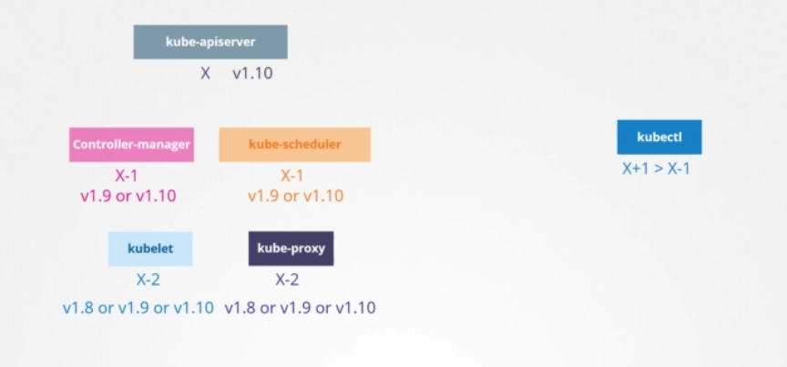

k8s supports up to the 3 latest minor versions- recommended upgrade is one version at a time, do not jump minor versions.

upgradaing a clusters consists of two steps

1. upgrading your master nodes - while the master node is being upgraded, the control plane components (apiserver, scheduler...) go down briefly; worker nodes keep functioning normally. since the master is down all management functions are down; you can't access the cluster using kubectl or the api, no new apps...
2. upgrading the worker nodes
   1. upgrade them all at once, takes down the app - requires downtime
   2. one at a time, load is moved to other nodes while the node is being updated
3. add new nodes with the new software version and decommision old ones

kubeadm upgrade

- `kubeadm upgrade plan` - information
- `kubeadm upgrade apply`

**kubeadm does not install nor upgrades kubelets**. after we upgrade the control plane controllers we have to manually upgrade the kubelet version on each node. upgrande plan gives us the information to apply the upgrade on the nodes - but first we have to upgrade kubeadm on the cluster.

```console
apt upgrade -y kubeadm=1.12.0-00 <<<---upgrade kubeadm
kubeadm upgrade plan <<<--- gives us the command to upgrade the cluster
kubeadm upgrade apply v1.12.0 <<<--- upgrade the cluster
```

when we run `kubectl get nodes` we see the version of the kubelets registered on the api server, not the version of the api server itself. then we upgrade the kubelet on the **master** node

```console
apt upgrade -y kubelet=1.12.0-00
systemctl restart kubelet
```

then the worker nodes will have kubelet upgraded. first we have to empty them:

```console
kubectl drain node1 <<<--- reschedule pod to other nodes and marks the node as unschedulable
apt upgrade -y kubeadm=1.12.0-00
apt upgrade -y kubelet=1.12.0-00
kubeadm upgrade node ocnfig --kubelet-version v1.12.0
systemctl restart kubelet
kubectl uncordon node1
```

Demo

```console
##############
##  MASTER  ##
##   NODE   ##
##############
apt update
apt-cache madison kubeadm <<<--- look for the latest version
apt-mark unhold kubeadm && apt-get update && apt-get isntall -y kubeadm=1.19.0-00 && apt-mark hold kubeadm
kubeadm version <<<--- should be updated
sudo kubeadm upgrade plan <<<--- see actual version running and possible update
sudo kubeadm upgrade appy v1.19.6 -y
kubectl drain controlplane(masternodename) --ignore-daemonsets
apt-mark unhold kubelet kubectl && apt-get update && apt-get install -y kubelet=1.19.6-00 kubectl=1.19.6-00 && apt-mark hold kubelet kubectl
sudo systemctl daemon-reload
sudo systemctl restart kubelet
kubectl get nodes <<<--- should see new version
kubectl uncordon controlplane(masternodename)

##############
##  WORKER  ##
##  NODES   ##
##############
apt-mark unhold kubeadm && apt-get update && apt-get install -y kubeadm=1.19.6-00 && apt-mark hold kubeadm
sudo kubeadm upgrade node
####
kubectl drain node1 <<<--- from the control plane node
####
apt-mark unhold kubelet kubectl && apt-get updrate && apt-get install -y kubelet=1.19.6-00 && apt-mark hold kubelet kubectl
sudo systemctl daemon-reload
sudo systemctl restart kubelet
kubectl get nodes <<<--- should see new version
kubectl uncordon nodes
```

Practice test

```console
apt update
apt install kubeadm=1.19.0-00
kubeadm upgrade apply v1.19.0
apt install kubelet=1.19.0-00
sudo systemctl daemon-reload
sudo systemctl restart kubelet

#########
solution
#########
apt install kubeadm=<version>(1.18.0-00)
kubeadm upgrade apply v<version>(v1.18.0 - upgrade the cluster) 
kubectl version --short (cluster version)
apt isntall kubelet==<version>(1.18.0-00)
sudo systemctl daemon-reload
sudo systemctl restart kubelet
# node01
apt install kubeadm=<version>(1.18.0-00)
kubeadm upgrade node
apt isntall kubelet==<version>(1.18.0-00)
sudo systemctl daemon-reload
sudo systemctl restart kubelet
```

### BUR

what to backup?

- resource configuration: imperative or declarative files (preferred). store these files on github (also backedup). query kube-api server (best option for managed cluster). save all resource configuration: `kubectl get all --all-namespaces -o yaml > all-deployed-services.yaml`. VELERO
- etcd cluster - all cluster related information is stored: state of the cluster, nodes and every other resources on the cluster. instead of backing up resources, you may choose to backup the ETCD server itself. the ETCD cluster is configured on the master node. while configuring it we specified a location where all the data will be stored (--data-dir=/var/lib/etcd). ETCD has a builtin backup solution `ETCDCTL_API=3 etcdctl snapshot save snapshot.db` - view status of the snapshot: `ETCDCTL_API=3 etcdctl snapshot status snapshot.db`. restoring:
  - stop the kube api server service `service kube-apiserver stop` - we need to restart the etcd cluster and the kubeapi server depends on it.
  - `ETCDCTL_API=3 etcdctl snapshot restore snapshot.db --data-dir /var/lib/etcd-from-backup` when restoring, etcdctl initialices a new cluster config and configures the members of etcd as new members in a new cluster. this is to prevent a new member from joining an existing cluster - on this example, the file at the end of the command is created. then we need to configure the etcd.servive to use that file as the new --data-dir.
  - `systemctl daemon-reload`
  - `service etcd restart`
  - `service kube-apiserver start`
- persistent storage:

for all **etcdctl** snapshot commands we have to specify the --cacert, --cert and --key.

To make use of etcdctl for tasks such as back up and restore, make sure that you set the ETCDCTL_API to 3.

You can do this by exporting the variable ETCDCTL_API prior to using the etcdctl client. This can be done as follows:

`export ETCDCTL_API=3`

For example, if you want to take a snapshot of etcd, use: `etcdctl snapshot save -h` and keep a note of the mandatory global options.

Since our ETCD database is TLS-Enabled, the following options are mandatory:

- `--cacert`: verify certificates of TLS-enabled secure servers using this CA bundle
- `--cert`: identify secure client using this TLS certificate file
- `--endpoints=[127.0.0.1:2379]`: This is the default as ETCD is running on master node and exposed on localhost 2379.
- `--key`: identify secure client using this TLS key file

Similarly use the help option for snapshot restore to see all available options for restoring the backup: `etcdctl snapshot restore -h`

```console
root@controlplane:~# ETCDCTL_API=3 etcdctl snapshot save /opt/snapshot-pre-boot.db --cacert=/etc/kubernetes/pki/etcd/ca.crt --cert=/etc/kubernetes/pki/etcd/server.crt --key=/etc/kubernetes/pki/etcd/server.key
Snapshot saved at /opt/snapshot-pre-boot.db
###################################################
root@controlplane:~# etcdctl snapshot restore /opt/snapshot-pre-boot.db --cacert=/etc/kubernetes/pki/etcd/ca.crt --cert=/etc/kubernetes/pki/etcd/server.crt --key=/etc/kubernetes/pki/etcd/server.key --data-dir=/var/lib/etcd-from-backup
```

### Solution

First Restore the snapshot:

root@controlplane:~# ETCDCTL_API=3 etcdctl  --data-dir /var/lib/etcd-from-backup \
snapshot restore /opt/snapshot-pre-boot.db

```console
2021-03-25 23:52:59.608547 I | mvcc: restore compact to 6466
2021-03-25 23:52:59.621400 I | etcdserver/membership: added member 8e9e05c52164694d [http://localhost:2380] to cluster cdf818194e3a8c32
root@controlplane:~#
```

Note: In this case, we are restoring the snapshot to a different directory but in the same server where we took the backup (the controlplane node) As a result, the only required option for the restore command is the --data-dir.

Next, update the /etc/kubernetes/manifests/etcd.yaml:

We have now restored the etcd snapshot to a new path on the controlplane - /var/lib/etcd-from-backup, so, the only change to be made in the YAML file, is to change the hostPath for the volume called etcd-data from old directory (/var/lib/etcd) to the new directory /var/lib/etcd-from-backup.

```yaml
  volumes:
  - hostPath:
      path: /var/lib/etcd-from-backup
      type: DirectoryOrCreate
    name: etcd-data
```

With this change, /var/lib/etcd on the container points to /var/lib/etcd-from-backup on the controlplane (which is what we want)

When this file is updated, the ETCD pod is automatically re-created as this is a static pod placed under the /etc/kubernetes/manifests directory.

Note: as the ETCD pod has changed it will automatically restart, and also kube-controller-manager and kube-scheduler. Wait 1-2 to mins for this pods to restart. You can run a watch "docker ps | grep etcd" command to see when the ETCD pod is restarted.

Note2: If the etcd pod is not getting Ready 1/1, then restart it by kubectl delete pod -n kube-system etcd-controlplane and wait 1 minute.

Note3: This is the simplest way to make sure that ETCD uses the restored data after the ETCD pod is recreated. You don't have to change anything else.

If you do change --data-dir to /var/lib/etcd-from-backup in the YAML file, make sure that the volumeMounts for etcd-data is updated as well, with the mountPath pointing to /var/lib/etcd-from-backup (THIS COMPLETE STEP IS OPTIONAL AND NEED NOT BE DONE FOR COMPLETING THE RESTORE)

my notes

- address to reach ETCD cluster from the controlplane --listen-client-urls=127.0.0.1:2379
- server certificate: --cert-file=/etc/kubernetes/pki/etcd/server.crt
- etcd ca cert: --trusted-ca-file=/etc/kubernetes/pki/etcd/ca.crt

`ETCDCTL_API=3 etcdctl snapshot save /opt/snapshot-pre-boot.db --cacert=/etc/kubernetes/pki/etcd/ca.crt --cert=/etc/kubernetes/pki/etcd/server.crt --key=/etc/kubernetes/pki/etcd/server.key`;
`ETCDCTL_API=3 etcdctl --data-dir /var/lib/etcd-from-bur snapshot restore /opt/snapshot-pre-boot.db` - since it's the same server, only requires --data-dir arg

edit etc kubernetes manifests etcd.yaml; we have restored the etcd snapshot to a new path on the control plane, so the only change to be made in the yaml file is to change the hostPath for the volume called etcd-data to the new dir

Here's a quick tip. In the exam, you won't know if what you did is correct or not as in the practice tests in this course. You must verify your work yourself. For example, if the question is to create a pod with a specific image, you must run the the `kubectl describe pod` command to verify the pod is created with the correct name and correct image.

- <https://kubernetes.io/docs/tasks/administer-cluster/configure-upgrade-etcd/#backing-up-an-etcd-cluster>
- <https://github.com/etcd-io/etcd/blob/master/Documentation/op-guide/recovery.md>
- <https://www.youtube.com/watch?v=qRPNuT080Hk>

## security in k8s

security primitives. the hosts that hold the cluster itself: all access to these hosts must be secured, root access disabled, password based access disabled (only ssh key authentication)...

securing k8s components. kube-apiserver is at the center of all operation in k8s. controlling access to the kube-apiserver is the first line of defense. we need to make two types of decisions. who has access to the cluster and what can they do.

1. who has access: it depends on the authentication method. username/passwd, username/token, certificates, external authentication (ldap), service accounts (for machines)
2. what can they do: RBAC (users are associated to groups with certain permissions), ABAC (attributes), node authorization, webhook mode...

All communication involving the kube-apiserver to the kublet, kube proxy, scheduler, controller manager, etcd cluster is secured using TLS encryption.

communication between applications within the cluster: by default, all pods can access all other pods in the cluster. we can restrict access by using network policies.

### authentication

securing the cluster by securing the communication between components. securing access with authentication mechanisms.

1. admins: humans, aka user
2. developers: humans, aka user
3. application end users - access the apps on the cluster; managed by the application themselves internally
4. bots: service accounts

k8s does not manage user accounts natively, it relies on an external source, like a file with user details, or certificates or external certificate service (LDAP)

kubernetes _CAN_ manage service accounts. we can create and manage service accounts `kubectl create serviceaccount sa1` - `kubectl get servcieaccount`

all user access (admins and developers) is managed by the kube-apiserver, whether you are accessing via `kubectl` or `curl https://kube-server-ip:6443/`. the kube-api server authenticates the request before processing it

1. authenticate user: different mechanisms
   1. static password file: you can create a list of user and passwords using a csv file (passwordAasdf,user,u9991) as the source for user information. passwd,username,userID. we then pass the file as an option to the kube-apiserver: `--basic-auth-file=/etc/kubernetes/manifests/auth/static-file.csv`. after specifying this option (not there by default) you need to restart the kube-apiserver.service. setting up the cluster with kubeadm, we need to modify the yaml file under `/etc/kubernetes/manifests/kube-apiserver.yaml` the kube-apiserver pod definition file; this will restart the kube-apiserver pod. to access the kube-api server: `curl -v -k https://master-node-ip:6443/api/v1/pods -u "user1:passwrod"`. on the csv file we can have a fourth column, for groups. _NOT RECOMMENDED auth mechanism_ - consider volume mount while providing the auth file in a kubeadm setup; setup RBAuthorization for the new users.
   2. static token file: it's another csv file, token,username,userID,groupID. we specify the `--token-auth-file=user-details.csv`. using curl: `curl -v -k https://master-node-ip:6443/api/v1/pods --header "Authorization: Bearer <token>"`. _NOT RECOMMENDED auth mechanism_ - consider volume mount while providing the auth file in a kubeadm setup; setup RBAuthorization for the new users.
   3. certificates
   4. identity services (third parties, LDAP, kerberos)
2. process request

Setup basic authentication on Kubernetes (Deprecated in 1.19)

- Note: This is not recommended in a production environment. This is only for learning purposes. Also note that this approach is deprecated in Kubernetes version 1.19 and is no longer available in later releases

Follow the below instructions to configure basic authentication in a kubeadm setup.

Create a file with user details locally at _/tmp/users/user-details.csv_

```csv
# User File Contents
password123,user1,u0001
password123,user2,u0002
password123,user3,u0003
password123,user4,u0004
password123,user5,u0005
```

Edit the kube-apiserver static pod configured by kubeadm to pass in the user details. The file is located at /etc/kubernetes/manifests/kube-apiserver.yaml

```yaml
apiVersion: v1
kind: Pod
metadata:
name: kube-apiserver
namespace: kube-system
spec:
containers:
- command:
  - kube-apiserver
    <content-hidden>
  image: k8s.gcr.io/kube-apiserver-amd64:v1.11.3
  name: kube-apiserver
  volumeMounts:
  - mountPath: /tmp/users
    name: usr-details
    readOnly: true
volumes:
- hostPath:
    path: /tmp/users
    type: DirectoryOrCreate
  name: usr-details
```

Modify the kube-apiserver startup options to include the basic-auth file

```yaml
apiVersion: v1
kind: Pod
metadata:
  creationTimestamp: null
  name: kube-apiserver
  namespace: kube-system
spec:
  containers:
  - command:
    - kube-apiserver
    - --authorization-mode=Node,RBAC
      <content-hidden>
    - --basic-auth-file=/tmp/users/user-details.csv
```

Create the necessary roles and role bindings for these users:

```yaml
---
kind: Role
apiVersion: rbac.authorization.k8s.io/v1
metadata:
  namespace: default
  name: pod-reader
rules:
- apiGroups: [""] # "" indicates the core API group
  resources: ["pods"]
  verbs: ["get", "watch", "list"]
  
---
# This role binding allows "jane" to read pods in the "default" namespace.
kind: RoleBinding
apiVersion: rbac.authorization.k8s.io/v1
metadata:
  name: read-pods
  namespace: default
subjects:
- kind: User
  name: user1 # Name is case sensitive
  apiGroup: rbac.authorization.k8s.io
roleRef:
  kind: Role #this must be Role or ClusterRole
  name: pod-reader # this must match the name of the Role or ClusterRole you wish to bind to
  apiGroup: rbac.authorization.k8s.io
```

Once created, you may authenticate into the kube-api server using the users credentials

`curl -v -k https://localhost:6443/api/v1/pods -u "user1:password123"`

### TLS basics

a certificate is used to certificate trust between 2 parties within a transaction, a user trying to access a web-server. TLS certificates ensure that the communication between the user and the server is encrypted and the server is who it says it is. we must encrypt the data using a encryption keys. the data is encrypted using a key which is basically a set of random numbers and letters; you add the random information to the data and you encrypt it to a format that cannot be recognized.

the data is then sent to the server; when the server recieves the data, it is encrypted as well and cannot decrypt the data without the key. a copy of the key must also be sent to the server --> **symmetric encryption**. it is a secure way of encryption, but since **_it uses the same key to encrypt and decrypt the data_** and since the key has to be exchanged between the sender and the receiver there is a risk of a hacker gaining access to the key and decrypting the data.

that's where **asymmetric encryption** comes in. Instead of using a single key to encrypt and decrypt data, asymmetric encryption uses a pair of keys a private key and a public key.

- a key which is only with me: So it's private.
- A lock that anyone can access: So it's public.

The trick here is if you encrypt or lock the data with your lock you can only open it with the associated key. So your key must always be secure with you and not be shared with anyone else.

But the lock is public and may be shared with others but they can only lock something with it no matter what is locked. Using the public lock it can only be unlocked by your private key.

let’s look at an even simpler use case of securing SSH access to servers through key pairs. You have a server in your environment that you need access to. You don't want to use passwords as they're too risky. So you decide to use key pairs you generate a public and private key pair. You can do this by running the ssh_keygen command. It creates two files. Id_rsa is the private key and id_rsa.pub is the public key. Well, not a public key, a public lock. You then secure your server by locking down all access to it, except through a door that is locked using your public lock. It's usually done by adding an entry with your public key into the servers .ssh authorized_keys file.

So you see the look is public and anyone can attempt to break through. But as long as no one gets their hands on your private key, which is safe with you on your laptop, no one can gain access to the server. When you try to SSH you specify the location of your private key in your SSH command.

You see the problem we had earlier with symmetric encryption was that the key used to encrypt data had to be sent to the server over the network along with the encrypted data. And so there is a risk of the hacker getting the key to decrypt the data.

What if we could somehow get the key to the server safely. Once the key is safely made available to the server the server and client can safely continue communication with each other using symmetric encryption. to securely transfer the symmetric key from the client to the server, we use Asymmetric Encryption.

So, we generate a public and private key pair _on the server_.

Here we use the openssl command to generate a private and public key pair:

- `openssl genrsa -out my-bank.key 1024` --> private key
- `openssl rsa -in my-bank.ket -pubout > mybank.pem` --> public key

When the user first accesses the web server using https, he gets the public key from the server. Since the hacker is sniffing all traffic that is assumed he too gets a copy of the public key.

In fact the user's browser then encrypts the symmetric key using the public key provided by the server. The symmetric key is now secure - the user then sends this to the server. The hacker also gets a copy. the server uses the private key to decrypt the message and retrieve the symmetric key from it. However the hacker does not have the private key to decrypt and retrieve the symmetric key from the message it received. the hacker only has the public key with which he can only lock or encrypt a message and not decrypt the message. the symmetric key is now safely available only to the user and the server.

| moment | action                                                                                        | server                   | user                                                      | hacker                                                                    |
| ------ | --------------------------------------------------------------------------------------------- | ------------------------ | --------------------------------------------------------- | ------------------------------------------------------------------------- |
| 0      | user tries to access webserver                                                                | sends public key + CA to user | receives server's public key                              | receives server's public key                                              |
| 1      | browser encrypts the symmetric key using the public key provided by the server                |                          |                                                           |                                                                           |
| 2      | user sends user's symmetric key and the server's public key                                   |                          | sends a packet with symmetric key and server's public key | receives same packet with symmetric key and public server key             |
| 3      | the server uses the private key to decrypt the message and retrieve the symmetric key from it |                          |                                                           | hacker doesn't have the private key so he can't decrypt the symmetric key |
| 4      | symmetric key is only available to the user and the server                                    |                          |                                                           |                                                                           |

<https://www.youtube.com/watch?v=pArLLJmgX10>

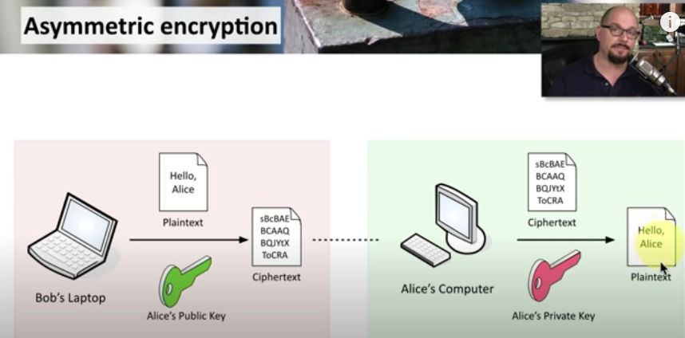

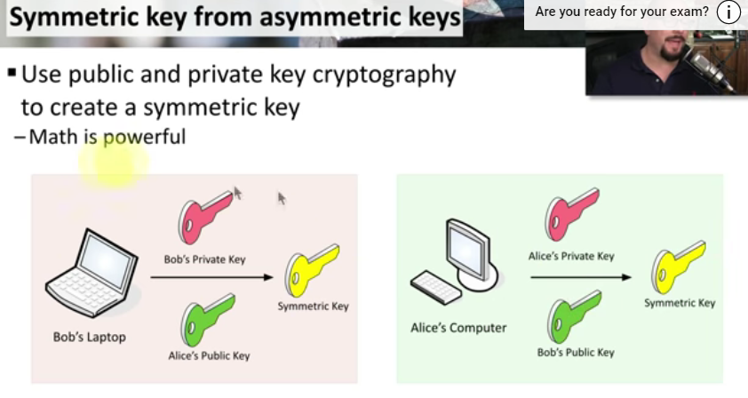

they can now use the symmetric key to encrypt data and send to each other the receiver can use the same symmetric key to decrypt data and retrieve information. The hacker is left with the encrypted messages and public keys with which he CAN'T decrypt any data with asymmetric encryption. We have successfully transferred the symmetric keys from the user to the server and that's symmetric encryption.

```txt
Perfect the hacker now looks for new ways to hack into our account and so he realizes that the only way he can get your credential is by getting you to type it into a form he presents. So he creates a Web site that looks exactly like your bank's web site. The design is the same. The graphics are the same. The Web site is a replica of the actual bank's Web site. He hosts the website on his own server. He wants you to think it's secure too. So he generates his own set of public and private key pairs and configure them on his web server.

And finally he somehow manages to tweak your environment or your network to route your requests going to your bank's web site to his servers. When you open up your browser and type the website address in you see a very familiar page the same login page of your bank that you're used to seeing.

So you go ahead and type in the username and password. You made sure you typed in HTTPS in the URL to make sure that communication is secure encrypted your browser receives the key you send encrypted symmetric key and then you send your credentials encrypted with the key and the receiver decrypt the credentials with the same symmetric key you've been communicating securely in an encrypted manner but with the hackers server. As soon as you send in your credentials, you see a dashboard that doesn’t look very much like your bank's dashboard.
```

What if you could look at the key you received from the server and see if it is a legitimate key from the real bank server. **when the server sends the key it does not send the key alone. It sends a certificate that has the key in it**. If you take a closer look at the certificate you will see that it is like an actual certificate.

But in a digital format it has information about who the certificate is issued to, the public key of that server, the location of that server etc. every certificate has a name on it the person or subject to whom the certificate is issued to.

That is very important as that is the field that helps you validate their identity.If this is for a web server this must match what the user types in the you are on his browser.

If the bank is known by any other names and if they like their users to access their application with the other names as well then all those names should be specified in the certificate under the subject alternative name section.

But you see anyone can generate a certificate like this. You could generate one for yourself saying you're Google and that's what the hacker did in this case. He generated a certificate saying he is your bank's web site. So how do you look at a certificate and verify if it is legit. That is where the most important part of the certificate comes into play _who signed and issued the certificate_.

If you generate the certificate then you will have to sign it yourself. That is known as a self-signed certificate. Anyone looking at the certificate you generated will immediately know that it is not a safe certificate because you have signed if you looked at the certificate you received from the hacker closely you would have noticed that it was a fake certificate that was signed by the hacker himself.

As a matter of fact your browser does that for you. All of the web browsers are built in with a Certificate validation mechanism, wherein the browser checks the certificate received from the server and validates it to make sure it is legitimate. if it identifies it to be a fake certificate then it actually warns you.

So then how do you create a legitimate certificate for your web servers that the web browsers will trust. How do you get your certificates signed by someone with **authority**. That’s where _Certificate Authorities or CAs_ comes in. They are well known organizations that can sign and validate your certificates for you. Some of the popular ones are Symantec, Digicert, Comodo, GlobalSign etc.

The way this works is you generate a **certificate signing a request or CSR** using the key you generated earlier and the domain name of your Web site. You can do this again using the open SSL command.

`openssl req -new -key my-bank.key -out my-bank.csr -subj "/C=US/ST=CA/O=MyOrg, Inc./CN=mydomain.com"`

This generates a my-bank.csr file which is the certificate signing request that should be sent to the CA for signing. It looks like this the certificate authorities verify your details and once it checks out they sign the certificate and send it back to you.

You now have a certificate signed by a CA that the process trust. if hacker tried to get his certificate signed the same way he would fail during the validation phase and his certificate would be rejected by the CA.

So the Web site that he's hosting won't have a valid certificate. The CAs use different techniques to make sure that you are the actual owner of that domain.

You now have a certificate signed by CA that the browsers trust. But how do the browsers know that the CA itself was legitimate. For example what if the certificate was signed by a fake CA.

In this case our certificate was signed by Symantec. How would the browser know Symantec is a valid CA and that the certificate was infact signed by Symantec and not by someone who says they are semantec. The CA is themselves have a set of public and private key pairs. The CA is use their private keys to sign the certificates the public keys of all the CAs are built in to the browsers. The browser uses the public key of the CA to validate that the certificate was actually signed by the CA themselves.

You can actually see them in the settings of your web browser, under certificates. They are under trusted CAs tab.

Now these are public CAs that help us ensure the public websites we visit, like our banks, email etc are legitimate.

However they don't help you validate sites hosted privately say within your organization. For example, for accessing your payroll or internal email applications. For that you can host your own private CAs.

Most of these companies listed here have a private offering of their services. A CA server that you can deploy internally within your company. You can then have the public key of your internal CA server installed on all your employees browsers and establish secure connectivity within your organization so let's summarize real quick.

We have seen why you may want to encrypt messages being sent over a network to encrypt messages. We use asymmetric encryption with a pair of public and private keys and admin uses a pair of keys to secure SSH connectivity to the servers. The server uses a pair of keys to secure HTTPS traffic. For this the server first sends a certificate signing request to a CA. The CA uses its private key to sign the CSR. Remember all users have a copy of the CAs public key.

The signed certificate is then sent back to the server the server configure is the web application with the signed certificate. Whenever a user accesses the web application the server first sends the certificate with its public key.

The user or rather the user's browser reads the certificate and uses the CA's public key to validate and retrieve the servers. Public key it then generates a symmetric key that it wishes to use going forward for all communication. The symmetric key is encrypted using the server as public key and sent back to the server the server uses its private key to decrypt the message and retrieve the symmetric key. The symmetric key is used for communication going forward so the administrator generates a key pair for securing SSH. the web server generates a key pair for securing the web site with HTTPS, the Certificate Authority generates its own set of key pair to sign certificates.

The end user though only generates a single symmetric key. Once he establishes trust with the Web site he uses his username and password to authenticate the Web server. with the servers key pairs the client was able to validate that the server is who they say they are but the server does not for sure know if the client is who they say they are. It could be a hacker impersonating a user by somehow gaining access to his credentials not over the network for sure as we have secured it already with TLS. May be some other means.

Anyway, So what can the server do to validate that the client is who they say they are. for this as part of the initial trust building exercise, The server can request a certificate from the client and so the client must generate a pair of keys and a signed certificate from a valid CA the client then sends the certificate to the server for it to verify that the client is who they say they are.

Now you must be thinking you have never generated a client's certificate to access a Web site. Well that's because TLS client certificates are not generally implemented on web servers; even if they are it's all implemented under the hood. So a normal user don't have to generate and manage certificates manually.

this whole infrastructure including the CA the servers the people and the process of generating distributing and maintaining digital certificates is known as public key infrastructure or PKI

finally let me clear up something before you leave I've been using the analogy of a key and lock for private and public keys. If I give you the impression that only the lock or the public key can encrypt data then please forgive me as it's not true.

These are in fact two related or paired keys. You can encrypt data with any one of them and only decrypt data with the other. You cannot encrypt data with one and decrypt with the same.

So you must be careful what you encrypt your data with. If encrypted data with your private key then remember anyone with your public key, which could really be anyone out there, will be able to decrypt and read your message.

Finally, a quick note on naming convention. Usually certificates with Public key are named crt or pem extension. So that’s server.crt, server.pem for server certificates or client.crt or client.pem for client certificates. And private keys are usually with extension .key, or –key.pem. For example server.key or server-key.pem. So just remember private keys have the word ‘key’ in them usually either as an extension or in the name of the certificate and one that doesn't have the word key in them is usually a public key or certificate.

### tls in k8s

securing sk8s cluster with tls certificates. three types of certificates

1. server certificates: generated by the servers
2. root certificates: generated by a Certificate Authority
3. client certificates: generated by users

- _certificate_ or public key: `.crt` or `.pem`
- _private key_: `.key` or `-key.pem`

communication between between all components of the k8s cluster also needs to be secured. requirement:

- servers use server ceretificates
- clients use client certificates


#### server certitifcates

- the _kube-apiserver_ exposes an https service that other components as well as external users use to manage the k8s cluster. it is a server and it rerquires certificates to secure all communicatoin with its clients, so we create a certificate and key pair - **apiserver.crt** and **apiserver.key**. (we can create specific kets to access the etcd and kubelet servers - **apiserver-etcd-client.crt|key** and **apiserver-kubelet-client.crt|key**)
- _etcd_ server also requires a pair of certificate and key pair - **etcdserver.crt** and **etcdserver.key**. the only component that talks to the etcd server is the kube-api server, so as far as the etcd server is concercened, the kube-apiserver is a client, so it needs to authenticate.
- _kubelet_ component services that also expose an https api endpoint that the kubeapi-server talks to, to interact with the worker nodes. requires **kubelet.crt** and **kubelet.key**

##### client certificates for clients

clients would be us, the admins, through kubectl or REST api.

- _admin_: certificate and key pair: **admin.crt** and **admin.key**
- _scheduler_ talks to the kube-api server to look for pods that need scheduling and then get the right pods on the right worker nodes. the scheduler is a client that access the kube-apiserver. as far as the kube-apiserver is concerned, the scheduler is just another client (like admins), so the kube-apiserver needs to validate its identity: **scheduler.crt** and **scheduler.key**.
- _kube control manager_ also requires access to the kube-apiserver so it also requires a certificate: **controller-manager.crt** and **controller-manager.key**.
- _kube-proxy_: requires client certificate: **kube-proxy.crt** and **kube-proxy.key**

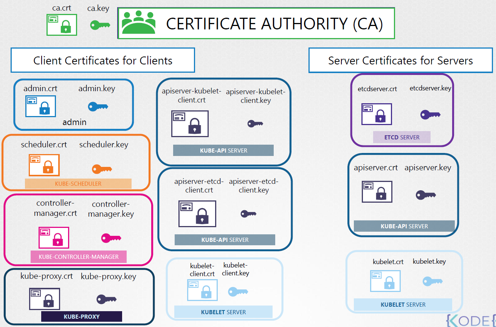

k8s requires at least one CA for your cluster. we can have more than one; one specific to etcd and one for the rest of the cluster components. etcd server certificates and the etcd server client certificates (api-server client certificate) will be signed by the etcd server Certificate Authority (CA).

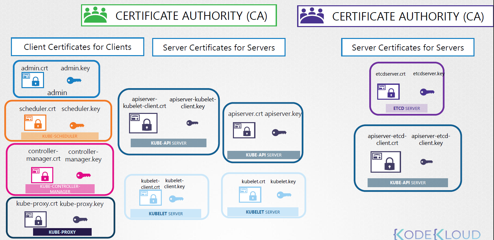

### generating certificates for the cluster

there are different tools: easyrsa, **openssl**, cfssl.

Certificate authority (CA) key, csr and crt; root certificate - this will need to be copied on all clients

1. create a keys: `openssl genrsa -out ca.key 2048`
2. create certificate signing request: `openssl req -new -key ca.key -sub "/CN=KUBERNETES-CA" -out ca.csr` - it's like a certificate with all of your details but with no signature. CN common name, what the certificate will be used for.
3. sign certificate: `openssl x509 -req -in ca.csr -signkey ca.key -out ca.crt`

#### client certificates

admin user

1. create a keys: `openssl genrsa -out admin.key 2048`
2. create certificate signing request: `openssl req -new -key admin.key -sub "/CN=kube-admin" -out admin.csr` - it's like a certificate with all of your details but with no signature. CN common name, what the certificate will be used for. the name can be anything - it's the name that kubectl client authenticates with when you run the kubectl command (that is the name that will appear on audit logs).
3. sign certificate: `openssl x509 -req -in admin.csr -signkey admin.key -out admin.crt`

to differentiate the admin user account from a regular user account we need to specify it the group details for the user in the certificate, say a group called "system:master" with admin privileges. this information must appear when creating the csr: `openssl req -new -key admin.key -sub "/CN=kube-admin/O=system:masters" -out admin.csr`

kube scheduler: system component part of the k8s controlplane, so it's name must be prefixed with the keyword **SYSTEM**. the same applies for controller manager and kube-proxy.

we can use the certificates we've created rather than username/password in the API calls: `curl https://kube-apiserver:6443/api/v1/pods --key admin.key --cert admin.crt --cacer ca.crt`. the other way is to move all these parameters to a config file called **kubeconfig**:

```yaml
# kube-config.yaml
apiVersion: v1
clusters:
- cluster:
    certificate-authority: ca.crt
    server: https://kube-apiserver:6443
  name: kubernetes
kind: Config
users:
- name: kubernetes-admin
  user:
    client-certificate: admin.crt
    client-key: admin.key
```

whenever you configure a server or a client with certificates, you will need to specify the CA root certificate as well.

#### server certificates

_etcd server_: same process, in case the etcd is formed by a cluster (HA environment), to ensure communication between the members of the cluster, we must create additional peer certificates. once created, we must specify them when starting the etcd server

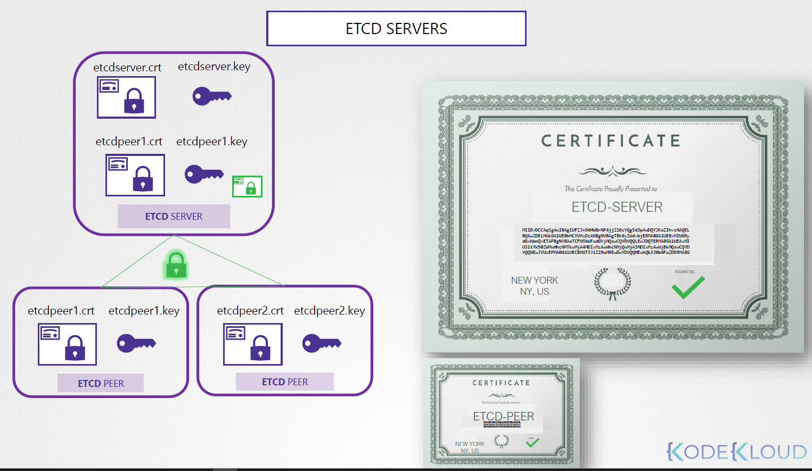

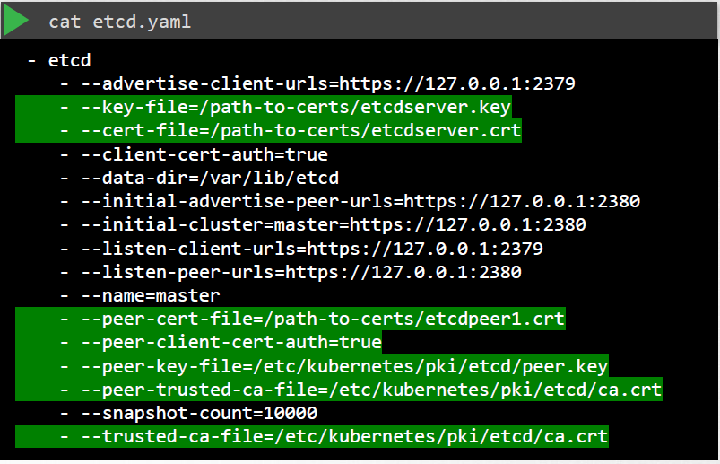

_kube-api server_ -->> this is it's real name; but some just call it kubernetes. others, kubernetes.default, kubernetes.default.svc, kubernetes.default.svc.cluster.local, or the IP of the pod for the API server or the IP of the server. all of these must appear on the kube-api certificate. only then those other names can be used to establish a valid connection.

- `openssl genrsa -out apiserver.key 2048`
- `openssl req -new -key apiserver.key -sub "/CN=kube-apiserver" -out apiserver.csr`. to attach the alternate names, we need to create an openssl config file

```cnf
[ req ]
req_extensions = v3_req
[ v3_req ]
basicConstraints = CA:FALSE
keyUsage = nonRepudiation,
subjectAlName = @alt_names
[ alt_names ]
DNS.1 = kubernetes
DNS.2 = kubernetes.default
DNS.3 = kubernetes.default.svc
DNS.4 = kubernetes.default.svc.cluter.local
IP.1 = 10.96.0.1
IP.2 = 172.17.0.87
```

`openssl req -new -key apiserver.key -sub "/CN=kube-apiserver" -out apiserver.csr -config openssl.cnf`

- `openssl x509 -req -in apiserver.csr -CA ca.crt -CAkey ca.key -out apiserver.crt`

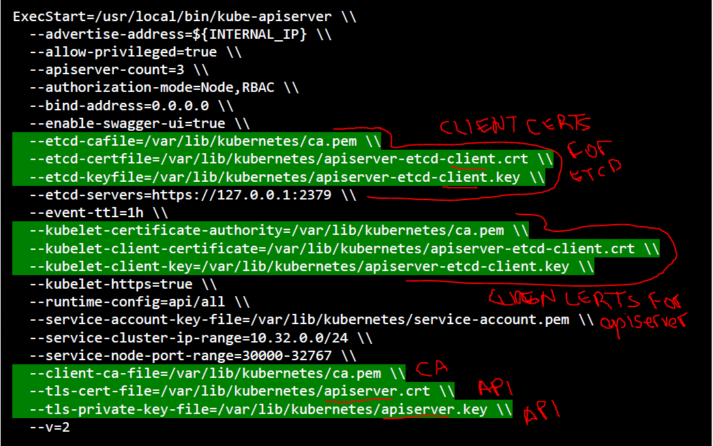

_kubelet server_: https api server that runs on each node. what the kube-api server talks to to send instructions and monitor de node. the certificates will be named after their nodes. once the certificates are created, used them on the kubelet-config.yaml file on each node:

```yaml
kind: KubeletConfiguration
apiVersion: kubelet.config.k8s.io/v1beta1
authentication:
  x509:
    clientCAFile: "/var/lib/kubernetes/ca.pem" # <<<--- highlighted
authorization:
  mode: Webhook
clusterDomain: "cluster.local"
clusterDNS:
  - "10.32.0.10"
podCID: "${POD_CIDR}"
resolvConf: "/run/systed/resolve/resolv.conf"
runtimeRequestTimeout: "15m"
tlsCertFile: "/var/lib/kubelet/kubelet-node01.crt" # <<<--- highlighted
tlsPrivateKeyFile: "/var/lib/kubelet/kubelet-node01.key" # <<<--- highlighted
```

_kubelet client cert_: used to authenticate to the api-server. naming: `system:node:<nodeName>` - the nodes must be added to a group named **system:nodes**.

### view certificate details

how was the k8s server configured? entirely manual work or using another tool? kubeadm?

- if manually configured: `cat /etc/systemd/system/kube-apiserver.service` to check which certificates are present and configured.
- automated provisining: `cat /etc/kubernetes/manifests/kube-apiserver.yaml`

to check the information on a .crt file: `openssl x509 -in /etc/kubernetes/pki/apiserver.crt -text -noout`. check

- **Subject**: name of the certificate
- **Alternate Name**
- **Validity**: Not After... expired?
- **Issuer**: CA who issued the certificate

checking logs: `journalctl -u etcd.service -l` if the service was configured at the server level. `kubectl logs etcd-master` if configured as a pod with kubeadm or `docker logs <contID>`

#### practice

- main tls certificate: `--tls-cert-file=/etc/kubernetes/pki/apiserver.crt`
- root ca for etcd is the same for the kube-apiserver config file as the path for the etcd file (just check if etcd root ca points to where it should)

### TLS certificates and API

a CA server - to gain access to the cluster, we have to generate a key and a CSR (certificate signing request), send it to the CA server for it to sign it.

CA server is made up of a pair of key and certificate files. who has access to these files can sign any certificates for the k8s environment. since these files have to be secure, we can dedicate an entire node that is entirely secure to store them.

kubeadm creates these files on the master node.

automatically rotating and signing certificates. kubernetes has a builtin _CERTIFICATES API_ that can do this. we can send a CSR directly to kubernetes through an API call; when the admin receives a CSR, they can create a k8s object called **CertificateSigningRequest** - all admins can view the sigining requests and approve them using kubectl commands.

1. user creates a key: `openssl genrsa -out jaliaga.key 2048`
2. user creates a csr: `openssl req -new -key jaliaga.key -subj "/CN=jaliaga" -out jaliaga.csr`
3. user sends the request to the admin
4. admin takes the csr and creates a CertificateSigningRequest object
   1. creates manifest file (see below)
   2. encode the received csr: `cat jaliaga.csr | base64` (to decode it `echo "asddkfasf" | base64 --decode`)
5. review requests: `kubectl get csr`
6. approve requests: `kubectl certificate approve jaliaga` (`kubectl certificate deny jaliaga` && `kubectl delete csr jaliaga`)
7. this certificate can be extracted and shared with the user: `kubectl get csr jaliaga -o yaml`

```yaml
apiVersion: certificates.k8s.io/v1beta1 # certificates.k8s.io/v1
kind: CertificateSigningRequest
metadata:
  name: jaliaga
spec:
  groups:
  - system:authenticated
  usages:
  - digital signature
  - key encipherment
  - server auth
  request: #base64 encoded request - one single line
```

the component responsible for all certificate operations is the _CONTROLLER MANAGER_. it has controllers called _csr-approving_, _csr-signing_...

if anyone wants to sign certificates, they must have the CA server root certificate and private key (`cat /etc/kubernetes/manifests/kube-controller-manager.yaml`). the controller-manager service configuration has two configuations we should look at: `--cluster-signing-cert-file` and `--cluster-signing-key-file`

### kubeconfig

by default, kubectl looks for a file under `$HOME/.kube/config` where there should be a kubeconfig file specifying --server, --client-key, --client-certificate, --certificate-authority... the kubeconfig file has three sections:

1. clusters: the various k8s clusters you need access to (test, development, prod...).
2. contexts: join clusters and users; they define which user account will be used to access which cluster. Admin@Production context grants access to the production cluster as Admin user. Dev@Google... no users are created, we are using existing users with existing privileges and defyning which has access to which cluster.
3. users: user accounts with which you have access to different clusters (admin, dev user, prod user...) - these users may have different privileges on different clusters

- **--server** specification goes into the cluster section
- **--client-key**, **--client-certificate** and **--certificate-authority** go into the user section

then we create a context that specifies `<user>@<cluster>`.

```yaml
# kubeconfig file
apiVersion: v1
kind: Config
current-context: developer@development # <<<<----- DEFAULT context
clusters: # 1 fill this section
- name: my-kube-playground
  cluster:
    certificate-authority: ca.crt # full path
    server: https://my-kube-playground:6443

- name: development
  cluster:
    certificate-authority: ca.crt # full path
    server: https://development:6443

contexts:
- name: my-kube-admin@my-kube-playground
  context:
    cluster: my-kube-playground
    user: my-kube-admin

- name: developer@development
  context:
    cluster: development
    user: developer

users:  # 2 fill this section
- name: my-kube-admin
  user:
    client-certificate: admin.crt # full path
    client-key: admin.key # full paths

- name: developer
  user:
    client-certificate: dev.crt # full path
    client-key: dev.key # full paths
```

this file is left as is and it will be read by the kubectl command. how does kubectl know which context to use? field current-context. `kubectl config view` view information on the default config file; `kubectl config view --kubeconfig=my-custom-file`. to update the current context: `kubectl config use-context my-kube-admin@my-kube-playground` - this changes the default, the **current-context**.

namespaces + kubeconfig: we can specify the default namespace (when we switch to that ns) under contexts > context > add "namespace: wharever".

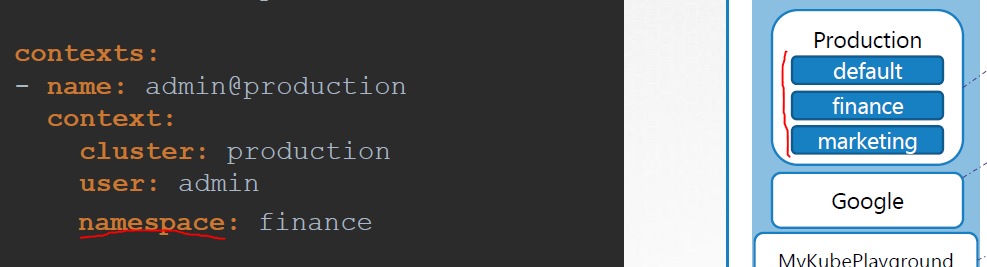

rather than specifying the ca full path, we can specify a field called **certificate-authority-data:** with the information on the CA encoded (`cat /etc/kubernetes/pki/ca.crt | base64`)

- using a context defined on a file: `kubectl config --kubeconfig=/root/my-kube-config use-context research`
- defining a custom kubeconfig file: ``

### api groups

- `curl https://kube-master:6443:/version` viewing version of the cluster
- `curl https://kube-master:6443:/metrics` and `curl https://kube-master:6443:/healthz` to monitor the health of the cluster
- `curl https://kube-master:6443:/logs` integrating with third party apps
- `curl https://kube-master:6443:/api` - core group. all core functionalities exist
  - /v1
    - namespaces | pods | rc | events | endpoints | nodes | bindings | PV | PVC | configmaps | secrets | services
- `curl https://kube-master:6443:/apis` - named group. more organized. newer features will be made available through these named groups:
  - /apps | /extensions | networking.k8s.io | storage.k8s.io | authentication.k8s.io | certificates.k8s.io

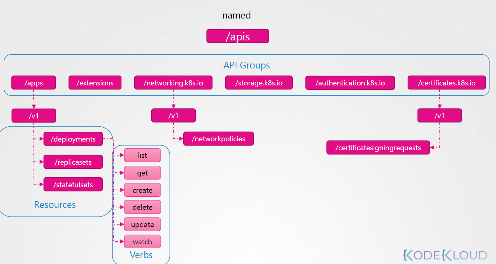

- `curl http://localhost:6443 -k`
- `curl http://localhost:6443 -k | grep "name"` -- supported resource groups
- `curl http://localhost:6443 -k --key admin.key --cert admin.crt --cacer ca.crt`
- to avoid the previous line, we can start a `kubectl proxy` client - that command launches a local proxy on port **8001** and uses credentials from the kube proxy file to access the cluster.
- `curl http://localhost:8001  -k`

`kube proxy` (used to enable connectivity between pods and services accross different nodes in the cluster) vs `kubectl proxy` (http proxy service created by kubectl utility to access the kube api server)

### authorization

what can users do once they've logged into the cluster. for instance, restricting certain accounts to be able to only view, rather than also being able to modify. restricting users to their namespaces can help us accomplish this. authorization mechanisms:

- node auth: the kube api is accessed by the users as well as the kubelets on other nodes. the requests (say for information about the state of the node) are handled by the _node authorizer_. for instance, kuebelets that try to gain access to the kube api and that are part of the system:node (they have that tag at the beginning of their certificate name) are allowed.
- ABAC (attribute) auth: external access, say a user. you associate a user or group of users with a set of permissions. say a user can: view, create and delete pods. we do this by creating a policy file in JSON format: `{"kind":"Policy", "spec":{"user": "dev-user", "namespace": "*", "resource": "pod", "apiGroup":"*"}}`. making changes to these files requires manual work an restarting the kube api server. ABAC difficult to manage
- RBAC auth: easier to manage. instead of directly associating a user/group with a set of permissions, we define a role. we create a role with a set of permissions required by, say, developers. then we associate the developers to that role. modifying a role takes effect immediately.
- webhook auth: checking with external apis for information

authorization modes:

- AlwaysAllow: no authorization checks
- AlwaysDeny: denies all requests

modes are set using the **--authorization-mode=** option on the kube-api server. if you don't specify this option, it's set by default to always allow.

`--authorization-mode=Node,RBAC,Webhook`: the request is authorized using each one on th e order specified (every time a request is denied, it goes to the next one - if one of the modules approves the request, no more checks and permission is granted). for example, when a user sends a request, it is first handled by the node authorizer, which only handles node requests - so it denies the request. whenever a module denies a request, it is forwarded to the next one in the chain. RBAC checks the user permissions and user is given access to the requested object.

### RBAC

creating a role by creating a role object. role def file

```yaml
apiVersion: rbac.authorization.k8s.io/v1
kind: Role
metadata:
  name: developer
rules:
- apiGroups: [""] # for core groups we can leave this blank; for any other group we need to specify the group
  resources: ["pods"]
  verbs: ["list", "get", "create", "update", "delete"]
  # allow developers to create configmaps
- apiGroups: [""]
  resources: ["ConfigMap"]
  verbs: ["create"]
```

`kubectl create -f <file>.yaml`

the we need to create a link of the user to the role: a binding. links a user object to a role

```yaml
# devuser-developer-binding.yaml
apiVersion: rbac.authorization.k8s.io/v1
kind: RoleBinding
metadata:
  name: devuser-developer
subjects: # user details
- kind: User
  name: dev-user
  apiGroup: rbac.authorization.k8s.io
roleRef:  # details of the role
  kind: Role
  name: developer
  apiGroup: rbac.authorization.k8s.io
```

`kubectl create -f <file>.yaml`

roles and role bindings fall under the scope of namespaces. to restrict ns access, modify config files.

- `kubectl get roles` to view roles
- `kubectl get rolebindigs`
- `kubectl describe role developer`
- `kubectl describe rolebinding devuser-developer-binding`

check my accesses:`kubectl auth can-i create deployments | delete nodes`; switch user **--as**: `kubectl auth can-i create deployments --as dev-user | create pods --as dev-user`; we can add **--namespace test** to check permissions especifically to that ns.

restrict access to the role, under rules, add `resourceNames: ["blue","orange"]` (in the example, there are 5 pods, all different colors)

### cluster role and cluster role bindings

roles and rolebindings are namespaced, they are created within namespaces; if you don't specify the namespace, they are created in the default namespace and control access. we can't group nodes within a namespace.

resources are categorized as namespaced or cluster-scoped. cluster-scoped when you don't specify the namespace


- full list of namespaced resources: `kubectl api-resources --namespaced=true`
- full list of cluster-scoped resources: `kubectl api-resources --namespaced=false`

authorizing users to cluster wide resources: cluster roles and cluster role bindings. like roles but for cluster scoped resources

we have to create a cluster role binding to link the user to the role

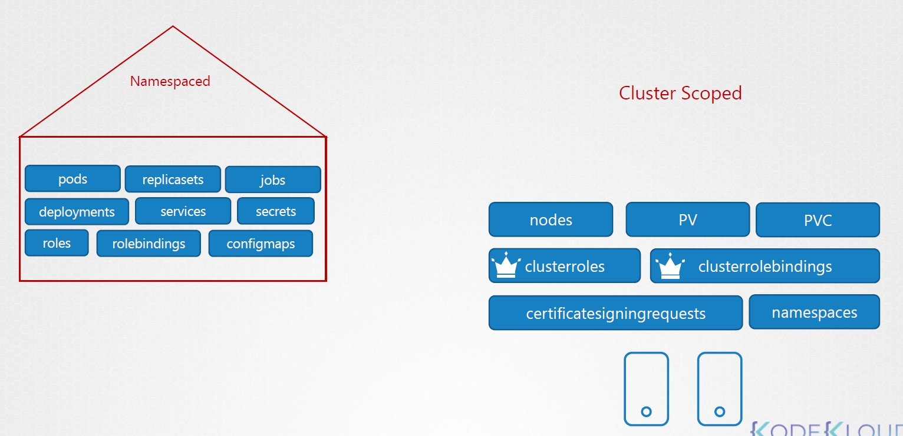

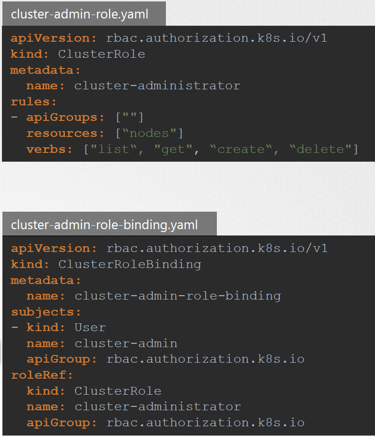

`kubectl create -f cluster-role-binding.yaml`

you can create a cluster role for namespaced resources as well. the user will have access to these resources accross all namespaces

### image security

image names: `image: nginx`; docker image naming conventions.

| registry | user/account | image/repository |
| ------- | ----- |------- |
| docker.io (assumed by default) | nginx/ | nginx |
| gcr.io (google) | kubernetes-e2e-test-images | dnsutils|

private registry - following docker way of doing things, we need to first log into our docker registry: `docker login private-registry.io` + credentials. run images: `docker run|pull private-registry.io/apps/internal-app` - for a pod def file, we would use the full path.

as regards authentication for the docker runtime. we need to create a secret object with the credentials in it

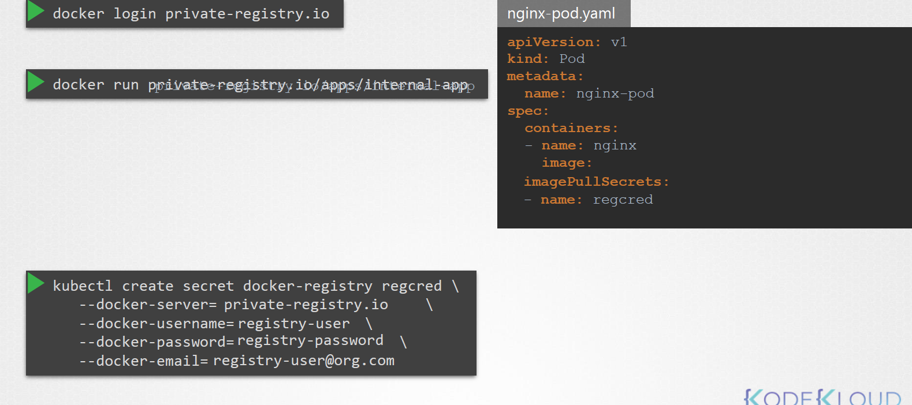

- `kubectl create secret docker-registry private-reg-cred --docker-username=dock_user --docker-password=dock_password --docker-server=myprivateregistry.com:5000 --docker-email=dock_user@myprivateregistry.com`

```yaml
containers:
- image: myprivateregistry.com:5000/nginx:alpine
  imagePullPolicy: IfNotPresent
  name: nginx
imagePullSecrets:
- name: private-reg-cred
```

### security contexts

we can define security standards, id of the user, linux capability: `docker run --user=1001 ubuntu sleep 3600 | --cap-add MAC_ADMIN ubuntu`... these can be defined in k8s as well. settings can be configured at a container or pod level. configuration at pod level will carry over to all containers in the pod. if both are configured, settings on the containter will overwrite the pod settings for the container.

```yaml
# configuration at a pod level
apiVersion: v1
kind: Pod
metadata:
  name: web-pod
spec:
  jjjj
  containers:
  - name: ubuntu
    image: ubuntu
    command: ["sleep","3600"]
# configuration at a container level
apiVersion: v1
kind: Pod
metadata:
  name: web-pod
spec:
  containers:
  - name: ubuntu
    image: ubuntu
    command: ["sleep","3600"]
    securityContext:
      runAsUser: 1000
      capabilities: # only supported at container level and not at the POD level
        add: ["MAC_ADMIN"]
```

### network policy

- traffic: ingress and egress.

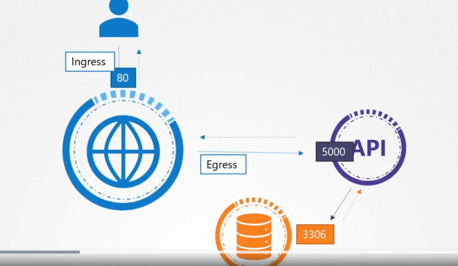

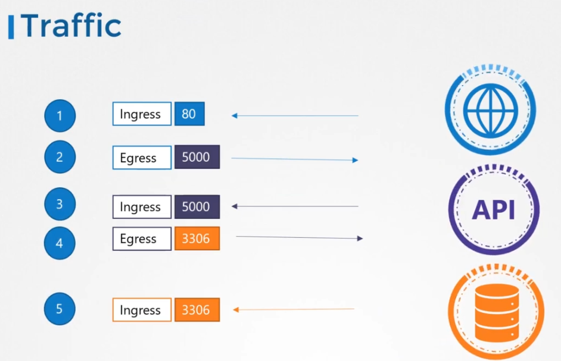

- network security: pods should be able to talk to each other, all can reach other via ips, svcs or names. All allow by default. svcs to allow communication between pods; we can implement a policy to prevent the front end pod to gain access to the db.
- a **network policy** is a k8s object - you link a network policy to one or more pod; you can define one or more rules within a network policy. allow ingress traffic coming from one pod - this policy only applies to whatever pod it is applied to - how do we apply the policy? similar to assigning replica sets to pods: labels and selectors

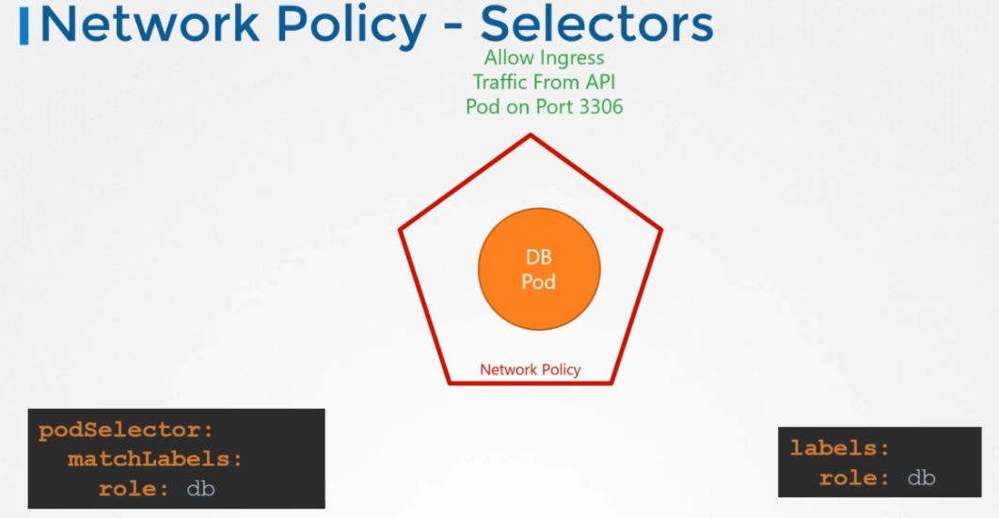


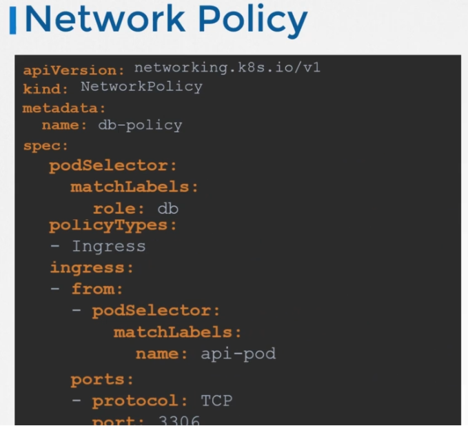

not all networking solution support network policies (flannel doesn't) - some that do: calico, romana, kube-router, weave-net...

### developing network policies

first we need to block everything from going in and out from the pod

```yaml
# assign policy to pod
apiVersion: networking.k8s.io/v1
kind: NetworkPolicy
metadata:
  name: db-policy
spec:
  podSelector:
    matchLables:
      role: db
  policyTypes:
  - Ingress
  ingress:
  - from: 
    - podSelector:  # rule 1
        matchLabels:
          name: api-pod
      namespaceSelector:
        matchLabels:
          name: prod
    - ipBlock:      # rule 2
        cidr: 192.168.5.10/32
    ports:
    - protocol: TCP
      port: 3306
```

there are 2 rules - if either one of them is ok, the traffic is allowed; in case of the first rule, traffic will be allowed if both specification are ok (podSelector AND namespaceSelector).

if we create an Ingress policy, it enables traffic to return through the same road (?); we must consider the direction from where the request originates, no need to worry about the response.

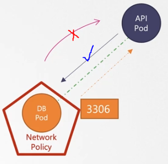

```yaml
# egress example
apiVersion: networking.k8s.io/v1
kind: NetworkPolicy
metadata:
  name: db-policy
spec:
  podSelector:
    matchLables:
      role: db
  policyTypes:
  - Ingress
  - Egress
  ingress:
  - from:
    - podSelector:
        matchLabels:
          name: api-pod
    ports:
    - protocol: TCP
      port: 3306
  egress:
  - to:
    - ipBlock:
      cidr: 
    ports:
      - protocol: TCP
        port: 80
```

## storage
