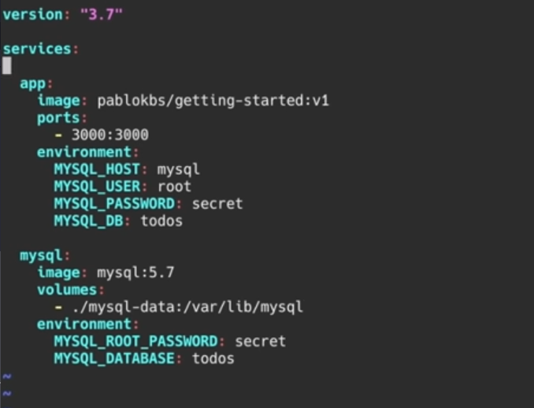

# Pelado nerd

<https://www.youtube.com/watch?v=CV_Uf3Dq-EU>

para correr un contenedor necesitamos una iamgen. qué forma una imagen? la distribución del os (el kernel se comparte con el host), software (apache, php, librerías de php... dependencias) y el código de la app.

Para generar una imagen usamos el docker file:

```yaml
# Dockerfile

FROM ubuntu

RUN apt-get isntall apache2

COPY code/ /var/www

CMD [ "apache2" ]
```

- `docker build <dockerFile>`
- `docker pull`
- `docker run <image>`

tag: diferentes versiones de una imagen

-e --> variable de entrono

- `docker run -e POSTGRES_PASSWORD=password postgres` - docker run ejecuta un contenedor nuevo a partir de una imagen
- `docker ps` - `docker ps -a`
- correr en background: `docker run -d <imagen>`
- iniciar el mismo contenedor `docker start <CONTAINER ID>`
- ver los logs de un contenedor `docker logs <CONTAINER ID>`; también pueden ser los nombres de los contenedores; `docker logs -f <CONTAINER ID>` para seguir el log en vivo; el log de las apps tiene que ir al stdout, no a un archivo así podemos ver el el output cuando corremos docker logs
- `docker exec -it <CONTAINER ID> sh` ejecuta un comando dentro de un contenedor que ya está corriendo; en este caso **-i** interactiva **-t** terminal y **sh** para shell
- `docker stop <CONTAINER ID>`
- `docker images` --> ver imágenes de docekr descargadas

el docker file tiene que llamarse así **Dockerfile**

```txt
FROM <image>:tag 

WORKDIR /app    # dentro del directorio donde estoy parado
COPY . .        # copiar los archivos de la carpeta donde estoy parado (1er punto) en la carpeta donde estoy parado dentro del contenedor (2do punto)
RUN yarn install --production

CMD ["node", "/app/src/index.js"]
```

- crear un contenedor: `docker build -t <nombreDeLaImagen> .`
- abrir puertos en un contenedor: `docker run -p 3000:3000 <image>`
- volúmenes, datos persistentes: `docker run -d -v <rutaDeMiMáquinaConLoQueQueremosPonerEnElContenedor>:<rutaEnElContenedor> -p <puerto>:<puerto> <imagen>`; la información se va a guardar en la ruta que le pasamos.
- los volúmenes nos permiten modificar el código de la app al vuelo, mientras corre.

## docker compose



- `docker-compose up -d`
