# Puppet

automation configuration management

1. puppet language: write code for config on the puppet nodes
2. Puppet server: master, it holds the config- when the puppet agents connect it serves the config
3. Puppet DB: kees all the configuration for all the puppet agents
4. Facter: utility that maintains environment variables for the whole topology - we can set environment variables, create custom and external ones
5. Hiera: we can take a configuration and separate it from the values that we are going to apply to it; we take hardcoded values out of the configuration and making it more _modular_.

manage infrastructre as code

- puppet enterprise: supported versions
- open source puppet

<https://aws.amazon.com/quickstart/>

facter commands:

- global variable - similar to facts
- environment variable

a fact in puppet is something that tells you about the OS. to see a specific fact:

- `facter operatingsystem`
- `facter fqdn`

```rb
if ($OperatingSystem == "Linux") {
    $message = "This machine OS is of the type $OperatingSystem\n"
} else {
    $message = "This machine is unknown \n"
}

file { "/tmp/machineOperatingSystem.txt":
    ensure => file,
    content => "$message"
}
```

3 types of facts:

1. Core facts: fact that comes out-of-the-box with puppet
2. Custom facts
3. External facts

- `info facter` -- facter manual `facter help` - `facter --version`
- `facter` --> see all the core facts

How to create _custom facts_: `export FACTER_coolestteam="Cubs"` the actual facter is called "coolestteam".

```rb
if ($coolestteam == "Cubs") {
    $message = "The coolest team is $coolestteam\n"
} else {
    $message = "The coolest team \n"
}

file { "/tmp/machineOperatingSystem.txt":
    ensure => file,
    content => "$message"
}
```

FACTERLIB - it's a fact on it's own, an environment variable that we get to set with multiple different values from different files. we can use facterlib to hold all our facts.

1. the env FACTERLIB cannot be set: `env | grep "FACTERLIB` should not return anything.
2. create folders /var/facterlib/
3. add the contents to the ruby file

```rb
# river.rb
Facter.add('longest_river') do
    setcode "echo Nile"
end
#########
# wall.rb
Facter.add('longest_wall') do
    setcode "echo 'China Wall'"
end
```

4. use the export statement `export FACTERLIB = "/var/facterlib/river.rb`

External facts: used to use some sort of runtime configuration or to get a fact based "on something that just spins up"

1. on the agent machine, we need to create a directory: `mkdir -p /etc/facter/facts.d`
2. create a shell script in the directory - external-fact-test.sh

```bash
#!/bin/bash
echo "hostgroup = dev"
echo "environment = development"
```

3. change the permission of the script file: `chmod u+x <fullpathtoshfile>`
4. we can now see the variable present withing the key/value pair: `facter hostgroup` and `facter environment`

## configuring the puppet master and agent

### Hiera

hiera is a configuration software by puppet labs. it allows us to separate configuration code from functionality. when we write manifests, we can put different properties in and give them values, which are pretty much hardcoded; Hiera allows us to separate that, to take the value and the pair away from the actual configuration setting and putting them together dinamically so that we can reuse that configuration.

it's not _required_ to use Hiera. without Hiera, puppet works something like this

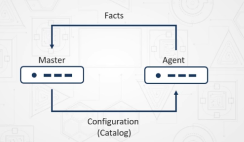

the master sends a config catalog to the agent so that the agent can configure itself. the agent communicates facts to the master and based on those facts, the master will push the configuration catalog to the agent so that it can apply the configuration.

With Hiera:

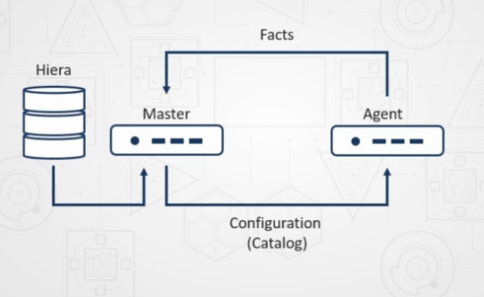

the flow is very similar - hiera has all the value-pair configuration in a db (not really). it's a yaml or json value-pair. the agent doesn't care about it. the master gets the value pair and puts it in the placeholder in the manifest, the class, or the module and pushes that value to the agent.

1. agent goes to the master
2. master goes to hiera
3. hiera returns data to the master
4. master sends data to the agent

3 layers:

1. global layer: applied to configuration for every machine
2. environment layer: production, QA, test, dev - configuration pushed to specific environments
3. module layer: smallest layer - only applied to the module

- pros:
  - separation between data and code (no need to hardcode)
  - clandestine storage, it's hidden more secure
  - integrates with back-end datastores
  - has conditional logic
- cons:
  - can be confusing
  - yaml sucks
  - hard to debug

```rb
exec { 'apt update':
    command => '/usr/bin/apt update'
}

package { 'apache2':
    require => Exec['apt-update'],
    ensure => installed,
}

sevice { 'apache2':
    ensure => running,
}
```

this example is hardcoded - hiera allows us to take these values and split them into value pairs, take our config and split the values.

Hiera checks _first the global_ hierarchy before checking any other source. it's mostly used for temporarily override a configuration (pisar otras configs)

```yml
# <ENVIRONMENT>/hiera.yaml
---
version: 5

defaults:
    datadir: data
    data_hash: yaml_data

hierarchy:
    - name: "Per-node data"
      path: "nodes/%{trusted.cername}.yaml"

    - name: "Per-OS defaults"
      path: "os/%{facts.os.family}.yaml"
    
    - name: "Common data"
      path: "common.yaml"
```

puppet agent manifest:

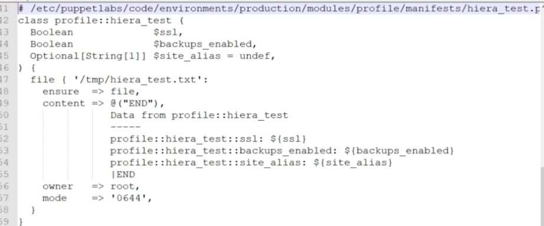

Hiera values:

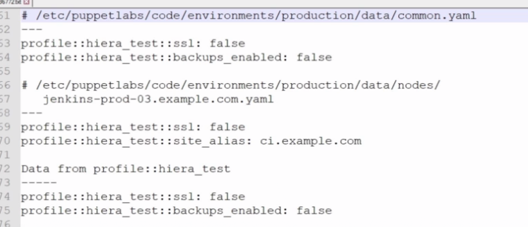

Coding a puppet module: when you want to apply a configuration to a puppet agent, you write a module on the puppet master. `cd /etc/puppet/modules`; `sudo puppet module generate ubuntu-jaliagastack` <-- this creates a directory structure. the code is written on `ubuntu-jaliagastack/manifests/init.pp`

```pp
class jaliagastack {

}
```

creating and running a class - stored under `/etc/puppet/modules/<moduleName>/manifests` we need to put those classes (which are init.pp files) in the main manifests, so when the puppet agent connects the master can apply those configurations. /etc/puppet/manifests/site.pp -->> this file inclues the names of the classes that will be applied (it will look under the modules dir for those classes):

```rb
node default { }

node 'linuxagent.example.com' {
    include lampserver # <-- class/module name
}

node 'windowsagent.example.com' {
    include iisserver
}
```

go to the linux puppet agent: `sudo puppet agent --test` goes to the master who will determine what class to apply

parameters in classes

- no parameters:

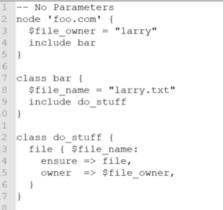

- with parameters:

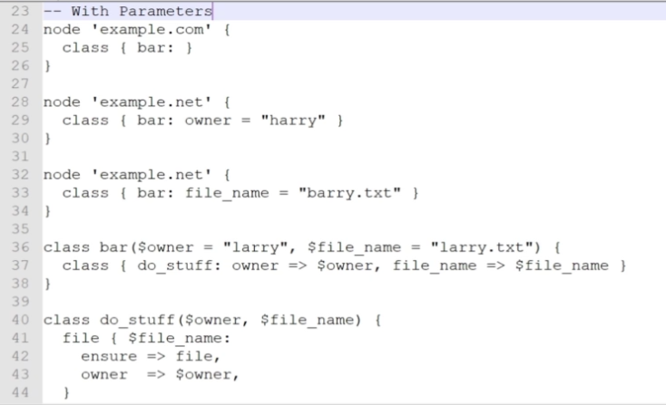

class inheritance - create a class, create a subclass

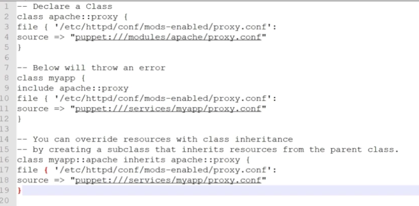

line 17 and 18 overwrites the file resource and source attribute on lines 3 and 4

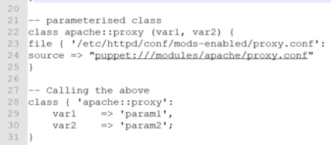

puppet resources are objects or actions that puppet uses to configure something. resource definition and attributes

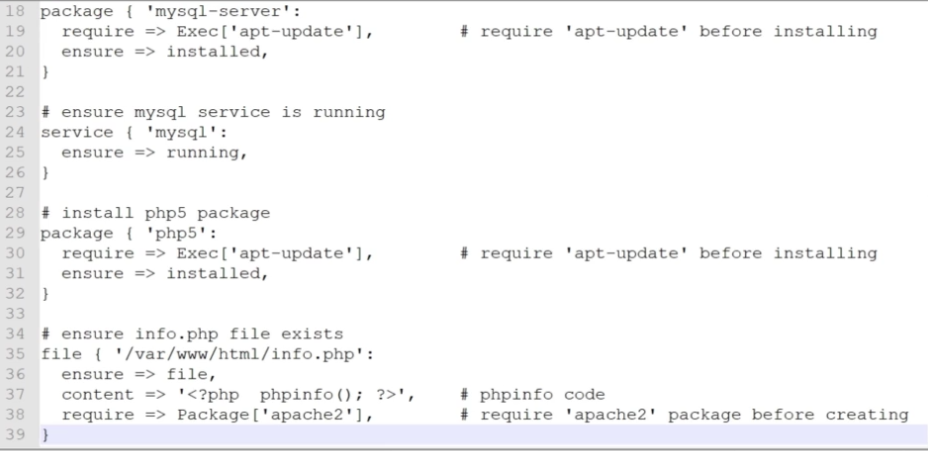

- line 18 --> packet resource, what should be installed
- line 24 --> server resource
- file 35 --> file resources

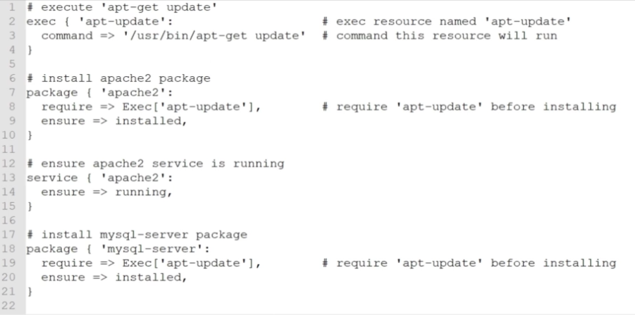

`puppet resource user ubuntu`; `puppet resource package puppet`; `puppet resource --help`

using resource - puppet code `/etc/puppet/manifests` files.pp. 

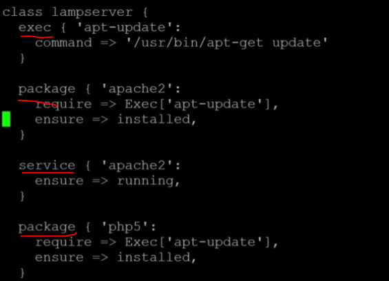

resources to be applied on the agent node

some attributes for popular resources - value pair

- ensure
- require
- installsubfeataures
- installmanagementtools
- content (file resource)

certain attributes are set based on the resource type

creating a custom resource type:

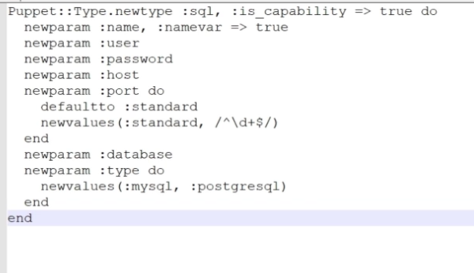

**types** are used to set the desired state of the system (what state services should be). set like core types.

1. `sudo puppet module generate <moduleName>`
2. code a manifest

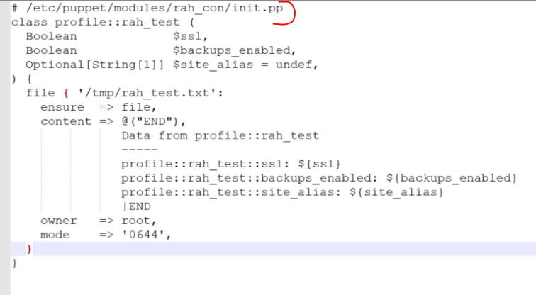

3. lines 12-14 --> these would have to be specified on Hiera .yaml file (on any of the levels)
4. on the agent: `sudo puppet agent --test` puppet agent will receive the catalog from the master so the agent can apply the configuration

templates: `/etc/puppet/templates`

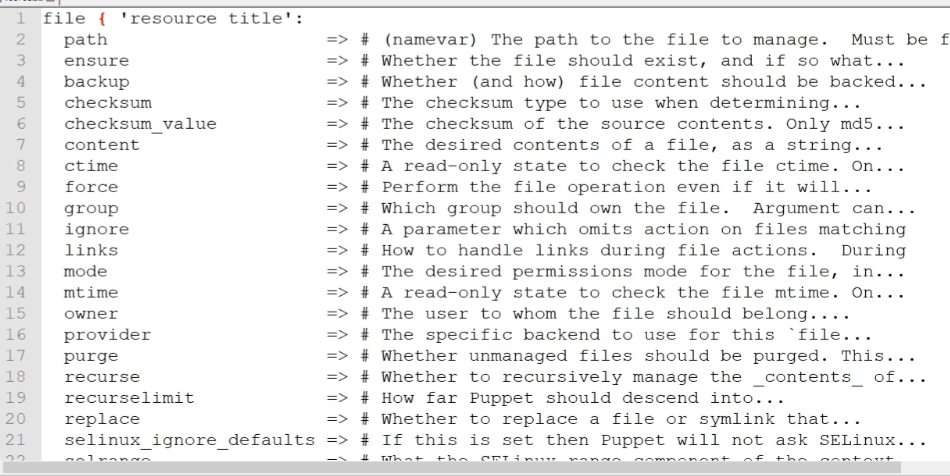

do some install and file management

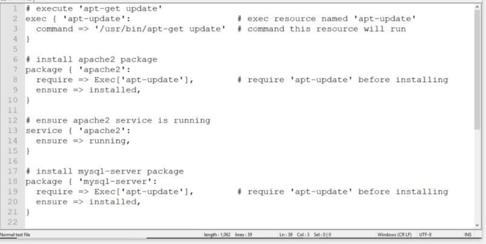

file management line 35

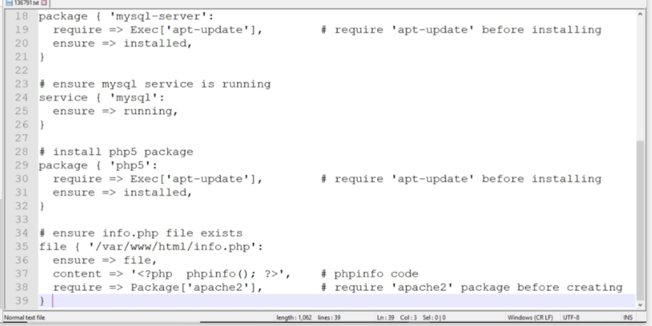

puppet functions - base language: ruby. statement function (stand on their own) or rvalue functions. rvalue return function when a statement requires a value (if function). execuent only on the MASTER, NEVER on the agents.

- include function; declaration of one or more classes and adds them to the catalog. only ONE class

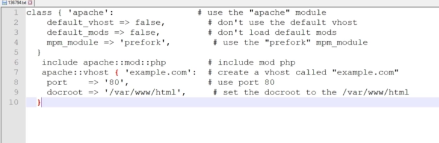

- define funciton: where a function is defined; can return a value or not. is the resource defined? does it have a value? at least one string arg, resource name, type name, variable reference. checks for native and custom function types. 4 examples of define functions

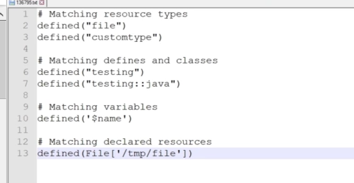

designing a function on puppet

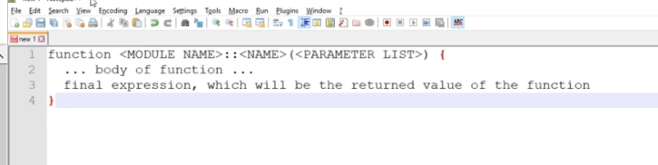

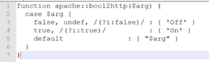

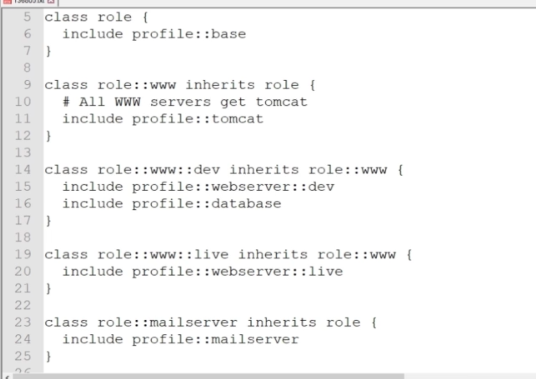

testing: <https://medium.com/swlh/install-puppet-server-on-docker-fe4a80cbe3be>
