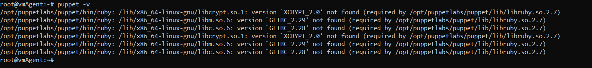

# puppet install and config

## links

- [system requirements](https://puppet.com/docs/puppet/7.6/system_requirements.html)
- [install puppet](https://puppet.com/docs/puppet/7.6/install_puppet.html#install_puppet)
- [puppet.conf](https://docs.oracle.com/cd/E88353_01/html/E37852/puppet-conf-5.html)

## commands

- `wget https://apt.puppet.com/puppet7-release-focal.deb`
- `sudo dpkg -i puppet7-release-focal.deb`
- `sudo apt update -y`
- `sudo apt install puppetserver -y`
- puppet/ssl: `mkdir -p /var/lib/puppet/ssl`
- `sudo chmod 0771 /var/lib/puppet/ssl`
- `sudo echo "ssldir = /var/lib/puppet/ssl" >> /etc/puppetlabs/puppet/puppet.conf`
- puppet/ssl/certs: `mkdir -p /var/lib/puppet/ssl/certs`
- `chmod 0755 /var/lib/puppet/ssl/certs`
- `echo "certsdir = /var/lib/puppet/ssl/certs" >> /etc/puppetlabs/puppet/puppet.conf`
- puppet/ssl/public_keys: `mkdir -p /var/lib/puppet/ssl/public_keys`
- `chmod 0755 /var/lib/puppet/ssl/public_keys`
- `echo "publickeydir = /var/lib/puppet/ssl/public_keys" >> /etc/puppetlabs/puppet/puppet.conf`
- puppet/ssl/certificate_requests: `mkdir -p /var/lib/puppet/ssl/certificate_requests`
- `chmod 0755 /var/lib/puppet/ssl/certificate_requests`
- `echo "requestdir = /var/lib/puppet/ssl/certificate_requests" >> /etc/puppetlabs/puppet/puppet.conf`
- puppet/ssl/private_keys: `mkdir -p /var/lib/puppet/ssl/private_keys`
- `chmod 0750 /var/lib/puppet/ssl/private_keys`
- `echo "privatekeydir = /var/lib/puppet/ssl/private_keys" >> /etc/puppetlabs/puppet/puppet.conf`
- puppet/ssl/private: `mkdir -p /var/lib/puppet/ssl/private`
- `chmod 0750 /var/lib/puppet/ssl/private`
- `echo "privatedir = /var/lib/puppet/ssl/private" >> /etc/puppetlabs/puppet/puppet.conf`
- to prevent having to do this, add `puppet  ALL=(ALL:ALL) ALL` to `/etc/sudoers`

- `export LD_LIBRARY_PATH="$LD_LIBRARY_PATH:/usr/lib64:/usr/lib/x86_64-linux-gnu/libcrypt.so.1.1:/lib64"`
- `vi /lib/systemd/system/puppetserver.service` --> User=root

```console
root@notthemaster:~# /opt/puppetlabs/bin/puppet -v
/opt/puppetlabs/puppet/bin/ruby: /lib/x86_64-linux-gnu/libcrypt.so.1: version `XCRYPT_2.0' not found (required by /opt/puppetlabs/puppet/lib/libruby.so.2.7)
/opt/puppetlabs/puppet/bin/ruby: /lib/x86_64-linux-gnu/libm.so.6: version `GLIBC_2.29' not found (required by /opt/puppetlabs/puppet/lib/libruby.so.2.7)
/opt/puppetlabs/puppet/bin/ruby: /lib/x86_64-linux-gnu/libc.so.6: version `GLIBC_2.28' not found (required by /opt/puppetlabs/puppet/lib/libruby.so.2.7)
/opt/puppetlabs/puppet/bin/ruby: /lib/x86_64-linux-gnu/libcrypt.so.1: version `XCRYPT_2.0' not found (required by /opt/puppetlabs/puppet/lib/libruby.so.2.7)
/opt/puppetlabs/puppet/bin/ruby: /lib/x86_64-linux-gnu/libm.so.6: version `GLIBC_2.29' not found (required by /opt/puppetlabs/puppet/lib/libruby.so.2.7)
/opt/puppetlabs/puppet/bin/ruby: /lib/x86_64-linux-gnu/libc.so.6: version `GLIBC_2.28' not found (required by /opt/puppetlabs/puppet/lib/libruby.so.2.7)
root@notthemaster:~#
```


